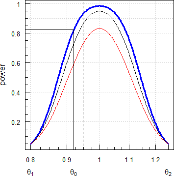

```{r, include = FALSE}
knitr::opts_chunk$set(
  collapse = TRUE,
  comment = "#>"
)
```
```{r setup}
library(PowerTOST) # attach the library
```
# Man-pages{#mans}
Man-pages of functions used in this vignette:

  * [sampleN.TOST](library/html/sampleN.TOST.html)
  * [power.TOST](library/html/power.TOST.html)
  * [power.TOST.sds](library/html/power.TOST.sds.html)
  * [CVCL](library/html/CVCL.html)
  * [expsampleN.TOST](library/html/expsampleN.TOST.html)
  * [CI.BE](library/html/CI.BE.html)
  * [CVpooled](library/html/CVpooled.html)
  * [CVfromCI](library/html/CVfromCI.html)

# Defaults{#defaults}

| Parameter | Argument | Purpose | Default |
|-|----|--------------|-------|
| $\alpha$ | `alpha` | Nominal level of the test | 0.05 |
| $\pi$ | `targetpower` | <span title="typically 0.80 – 0.90">Minimum desired power</span> | 0.80 |
| logscale | `logscale` | Analysis on log-transformed or original scale? | TRUE |
| $\theta_{0}$ | `theta0` | ‘True’ or assumed deviation of T from R | see below |
| $\theta_{1}$ | `theta1` | Lower BE limit | see below |
| $\theta_{2}$ | `theta2` | Upper BE limit | see below |
| *CV* | `CV` | CV | none |
| design | `design` | Planned design | \"2x2\" |
| method | `method` | Algorithm | exact (Owen’s Q) |
| robust | `robust` | ‘Robust’ evaluation (Senn’s basic estimator) | FALSE |
| print | `print` | Show information in the console? | TRUE |
| details | `details` | Show details of the sample size search? | FALSE |
| imax | `imax` | Maximum naumber of iterations | 100 |

Defaults depending on the argument `logscale`:

| Parameter | Argument | `logscale=TRUE` | `logscale=FALSE` |
|-|----|:--------:|:--------:|
| $\theta_{0}$ | `theta0` | 0.95 | +0.05 |
| $\theta_{1}$ | `theta1` | 0.80 | –0.20 |
| $\theta_{2}$ | `theta2` | 1.25 | +0.20 |

Arguments have to be given as ratios, not percent.\
The *CV* is generally the within-subject coefficient of variation. Only for `design="parallel"` it is the total (a.k.a. pooled) *CV*.

With `sampleN.TOST(..., print = FALSE)` results are given as a data.frame with eight columns `Design`, `alpha`,  `CV`, `theta0`, `theta1`, `theta2`, `Sample size`, `Achieved power`, and `Target power`. To access *e.g.*, the sample size use either `foo[7]` or `foo[["Sample size"]]`. We suggest to use the latter in your code for clarity.

The estimated sample size gives always the *total* number of subjects (not subject/sequence in crossovers or subjects/group in parallel designs).

<small>[TOC ↩](#TOC)</small>

# Sample size{#splsze}
## Example 1{#expl1}

Estimate the sample size for assumed intra-subject *CV* 0.30.
```{r}
sampleN.TOST(CV = 0.30)
```

Note that the sample size is always rounded up to give balanced sequences (here a multiple of 2). Since power is higher than our target, likely this was the case here. Let us check that.\
Which power will we get with a sample size of 39?

```{r}
power.TOST(CV = 0.30, n = 39)
```

Confirmed that with 39 subjects we will already reach the target power. That means also that one dropout will not compromise power. We can explore that further in a [Power Analysis](library/doc/PA.html).

<small>[TOC ↩](#TOC)</small>

Maybe the clinical site has a limited capacity. Any study can also be performed in a replicate design and assessed for ABE. As a rule of thumb the total sample in a 3-period replicate is ~¾ of the 2×2×2 design and the one of a 4-period replicate ~½ of the 2×2×2. The number of treatments and hence, of biosamples – which drives the study’s cost – will be roughly the same.
```{r}
designs <- c("2x2x2", "2x2x3", "2x3x3", "2x2x4")
# data.frame of results
res <- data.frame(design = designs,
                  n = NA, power = NA, n.do = NA, power.do = NA,
                  stringsAsFactors = FALSE)
for (i in 1:4) {
  # print = FALSE and details = FALSE suppress the output to the console
  # we are only interested in columns 7-8
  # let's also calculate power for one dropout
  res[i, 2:3] <- signif(sampleN.TOST(CV = 0.30, design = res$design[i],
                                     print = FALSE, details = FALSE)[7:8], 6)
  res[i, 4]   <-  res[i, 2] - 1
  res[i, 5]   <- suppressMessages(
                   signif(power.TOST(CV = 0.30, design = res$design[i],
                                     n = res[i, 4]), 6))
}
print(res, row.names = FALSE)
```

As expected, and as a bonus we get a small gain in power, though in the 4-period with one dropout power will be slightly compromised.\
But why is power in the replicate designs higher than in the 2×2×2? If residual variances are equal, the width of the confidence interval depends only on the *t*-value and in particular on the degrees of freedom – which themselves depend on the design and the sample size.

```{r, echo = FALSE}
designs <- c("2x2x2", "2x2x3", "2x3x3", "2x2x4")
res <- data.frame(design = rep(NA, 4), name = NA, n = NA, formula = NA,
                  df = NA, t.value = NA, stringsAsFactors = FALSE)
res[, c(2:1, 4)] <- known.designs()[which(known.designs()[, 2] %in% designs),
                                    c(9, 2:3)]
for (i in 1:4) {
  res$n[i]  <- sampleN.TOST(CV = 0.30, design = res$design[i],
                            print = FALSE, details = FALSE)[["Sample size"]]
  e         <- parse(text=res[i, 4], srcfile=NULL)
  n         <- res$n[i]
  res[i, 5] <- eval(e)
  res$t.value[i] <- signif(qt(1-0.05, df = res[i, 5]), 4)
}
res <- res[with(res, order(-n, design)), ]
print(res, row.names = FALSE)
```

If the capacity is 24 beds, we would opt for a 4-period full replicate.

<small>[TOC ↩](#TOC)</small>

As another option (*e.g.*, if the blood volume is limited and/or there are concerns about a higher dropout-rate in a multiple-period study) we could stay with the 2×2×2 design but split the sample size into groups. In Europe (and for the FDA if [certain conditions](https://bebac.at/lectures/Prague2018.pdf#page=7) are fulfilled), there are no problems pooling the data and use the conventional model.

```
sequence + subject(sequence) + period + treatment
```
However, some regulators prefer to incorporate group-terms in the model.

```
group + sequence + subject(group × sequence) + 
period(group) + group × sequence + treatment
```
Since we have more terms in the model, we will loose some degrees of freedom. Let us explore in simulations how that would impact power. By default function `power.TOST.sds()` performs 100,000 simulations.
```{r}
ngrp <- function(capacity, n) {
  # split sample size into >=2 groups based on clinical capacity
  if (n <= capacity) { # make equal groups
    ngrp <- rep(ceiling(n/2), 2)
  } else {             # at least one = capacity
    ngrp    <- rep(0, ceiling(n / capacity))
    grps    <- length(ngrp)
    ngrp[1] <- capacity
    for (j in 2:grps) {
      n.tot <- sum(ngrp) # what we have so far
      if (n.tot + capacity <= n) {
        ngrp[j] <- capacity
      } else {
        ngrp[j] <- n - n.tot
      }
    }
  }
  return(ngrp = list(grps = length(ngrp), ngrp = ngrp))
}
CV        <- 0.30
capacity  <- 24
res       <- data.frame(n = NA, grps = NA, pwr.1 = NA, pwr.2 = NA,
                        rel.loss = NA)
x         <- sampleN.TOST(CV = CV, print = FALSE, details = FALSE)
res$n     <- x[["Sample size"]]
res$pwr.1 <- x[["Achieved power"]]
x         <- ngrp(capacity = capacity, n = res$n)
res$grps  <- x[["grps"]]
ngrp      <- x[["ngrp"]]
res$pwr.2 <- power.TOST.sds(CV = CV, n = res$n, grps = res$grps,
                            ngrp = ngrp, gmodel = 2, progress = FALSE)
res$rel.loss <- signif(100*(res$pwr.2 - res$pwr.1)/res$pwr.1, 5)
print(signif(res, 6), row.names = FALSE)
```

With ~0.5\% the relative loss in power is practically negligble.

<small>[TOC ↩](#TOC)</small>

## Example 2{#expl2}
Estimate the sample size for equivalence of the ratio of two means with normality on original scale based on Fieller’s (‘fiducial’) confidence interval. Crossover design, within-subject *CV~w~* 0.20, between-subject *CV~b~* 0.40.
```{r}
sampleN.RatioF(CV = 0.20, CVb = 0.40)
```

In this function the default $\alpha$ is 0.025, since it is intended for studies with clinical endpoints, where the 95\% confidence interval is usually used for equivalence testing.^[EMEA, CPMP. *Points to Consider on Switching between Superiority and Non-Inferiority.* London, 27 July 2000. [CPMP/EWP/482/99](https://www.ema.europa.eu/en/documents/scientific-guideline/points-consider-switching-between-superiority-non-inferiority_en.pdf).]

<small>[TOC ↩](#TOC)</small>

## Example 3{#expl3}
Estimate the sample size based on the results of a 2×2×2 pilot study in 16 subjects where we found an intra-subject *CV* 0.20 and $\theta_{0}$ 0.92.

### Basic{#expl3basic}
If we believe [*sic*] that in the pivotal study both the $\theta_{0}$ and *CV* will be *exactly* like in the pilot, this is a straightforward excercise. We simply plug in the necessary arguments.

```{r}
sampleN.TOST(CV = 0.20, theta0 = 0.92)
```
This approach is called by some people ‘carved in stone’ because it relies on very strong assumptions which likely are not justified. Although power curves are relatively flat close to unity (*i.e.*, the impact on power is small when moving from say, $\theta_{0}$ 1 to 0.95) but they are getting increasingly steep when moving away more from unity.

{width=356px}

<small>[TOC ↩](#TOC)</small>

Essentially both the $\theta_{0}$ and *CV* carry (as every estimate) some uncertainty, where the degree of uncertainty depends on the sample size. Hence, it might not be good idea to perform very small pilot studies (*e.g.*, in only six subjects). Although it might be possible that in the pivotal study the *CV* is indeed *lower* than the one we observed in the pilot, it would be even more risky than the ‘carved in stone’ approach to assume a lower one in planning the pivotal study.

With the function `CVCL()` we can calculate confidence limits of the *CV*. It is advisable to use the upper CL as a conservative approach. As a side effect – if the *CV* will be lower than assumed – we get a ‘safety margin’ for the T/R ratio.

```{r}
df <- 16 - 2 # degrees of freedom of the 2x2x2 crossover pilot
CVCL(CV = 0.20, df = df, side = "upper", alpha = 0.20)[["upper CL"]]
```
I prefer <small>$\alpha=0.20$</small> in analogy to the producer’s risk <small>$\beta=0.20$</small> when planning for power <small>$\pi=1-\beta=0.80$</small>. Gould^[Gould AL. *Group Sequential Extension of a Standard Bioequivalence Testing Procedure.* J Pharmacokin Biopharm. 1995: 23(1); 57--86. [doi:10.1007/BF02353786](https://doi.org/10.1007/BF02353786).] suggested the more liberal 0.25. Let us repeat the sample size estimation with the upper limit.

```{r}
CL.upper <- CVCL(CV = 0.20, df = 16 - 2, side = "upper",
                 alpha = 0.20)[["upper CL"]]
res <- sampleN.TOST(CV = CL.upper, theta0 = 0.92, print = FALSE)
print(res[7:8], row.names = FALSE)
```
Of course, this has a massive impact on the sample size, which increases from 28 to 40. It might be difficult to convice the management to invest ~40\% more than with the ‘carved in stone’ approach.

<small>[TOC ↩](#TOC)</small>

However, we can also explore how power would be affected if our assumption is true and the study will nevertheless be performed with only 28 subjects.

```{r}
CL.upper <- CVCL(CV = 0.20, df = 16 - 2, side = "upper",
                 alpha = 0.20)[["upper CL"]]
power.TOST(CV = CL.upper, theta0 = 0.92, n = 28)
```
There will be a drop in power from the ~0.82 the management expects to only ~0.67. That’s just slightly higher than betting for two dozens in Roulette…

{width=353px}

As mentioned above, if the *CV* turns out to be lower than assumed, we gain headroom for the T/R ratio. Let us explore that. We perform the study with 40 subjects, the *CV* will be 0.22 (*less* than the ~0.24 we assumed), and the T/R with 0.90 *worse* than the 0.92 we assumed.

```{r}
power.TOST(CV = 0.22, theta0 = 0.90, n = 40)
```
Below our target but still acceptable.

<small>[TOC ↩](#TOC)</small>

### Advanced{#expl3adv}
In the [basic approach](#expl3basic) we concentrated mainly on the uncertainty of the *CV*. But this is not the end of the story. Clearly the $\theta_{0}$ is uncertain as well. With the function `expsampleN.TOST()` we can dive deeper into this area. Let us start with only the *CV*.
```{r}
expsampleN.TOST(CV=0.20, theta0 = 0.92, prior.type = "CV",
                prior.parm = list(m = 16, design = "2x2x2"))
```

Not that bad. The sample size increases from the 22 of the ‘carved in stone’ approach to 30 but is substantially lower than the 40 we estimated based on the upper confidence limit of the *CV*.

<small>[TOC ↩](#TOC)</small>

Let us keep the *CV* ‘fixed’ and take only the uncertainty of $\theta_{0}$ into account.
```{r}
expsampleN.TOST(CV=0.20, theta0 = 0.92, prior.type = "theta0",
                prior.parm = list(m = 16, design = "2x2x2"))
```
It starts to hurt. We learned already that power curves are getting steep when the T/R ratio is not close to unity. Our $\theta_{0}$ 0.92 was not very nice but in the pivotal study it might be even lower as well – which has a larger impact on power than the *CV*.

<small>[TOC ↩](#TOC)</small>

Now for the ‘worst case scenario’ where we take both uncertainties into account.
```{r}
expsampleN.TOST(CV=0.20, theta0 = 0.92, prior.type = "both",
                prior.parm = list(m = 16, design = "2x2x2"), details = FALSE)
```
This sample size is almost twice the 28 your boss got from his [Excel-Sheet](http://individual.utoronto.ca/ddubins/ "FARTSSIE"). If you are not fired when suggesting such a study, take it as a warning what might happen.\
At least, if the pivotal study fails in a lower sample size, *you* know why.

{width=353px}

If you are adventurous consider an Adaptive Two-Stage Sequential Design with sample size re-estimation. Various methods are supported in the package [Power2Stage](https://cran.r-project.org/package=Power2Stage).

<small>[TOC ↩](#TOC)</small>

# Power{#power}
Let us first recap the hypotheses in bioequivalence.

  1. The confidence inclusion approach (preferred in regulatory guidelines)
  $$H_0:\frac{\mu_T}{\mu_R}\notin \left [ \theta_1, \theta_2 \right]\:vs\:H_1:\theta_1<\frac{\mu_T}{\mu_R}<\theta_2$$

  2. The two one-sided testing procedure (TOST)^[Schuirmann DJ. *A Comparison of the Two One-Sided Tests Procedure and the Power Approach for Assessing the Equivalence of Average Bioavailability.* J. Pharmacokin. Biopharm. 1987; 15(6): 657--80. [doi:10.1007/BF01068419](https://doi.org/10.1007/BF01068419).]
  $$H_{0L}:\frac{\mu_T}{\mu_R} \leq \theta_1\:vs\:H_{1L}:\frac{\mu_T}{\mu_R}>\theta_1$$
  $$H_{0U}:\frac{\mu_T}{\mu_R} \geq \theta_2\:vs\:H_{1U}:\frac{\mu_T}{\mu_R}<\theta_2$$

Note that the Null hypotheses are bio**in**equivalence.

<small>[TOC ↩](#TOC)</small>

From a regulatory perspective the outcome of a comparative BA study is dichotomous. *Either* the study demonstrated BE (CI entirely within $\theta_{1},\theta_{2}$) *or* not. Only if the CI lies entirely outside $\theta_{1},\theta_{2}$ the Null hypothesis is not rejected and further studies not warranted.\
In any case, calculation of *post hoc* (a.k.a. *a posteriori*, retrospective) power is futile.^[Lenth RV. [*Two Sample-Size Practices that I don’t Recommend.*](http://homepage.divms.uiowa.edu/~rlenth/Power/2badHabits.pdf) University of Iowa, October 2000.] ^[Hoenig JM, Heisey DM. [*The Abuse of Power: The Pervasive Fallacy of Power Calculations for Data Analysis.*](https://www.vims.edu/people/hoenig_jm/pubs/hoenig2.pdf) Amer. Stat. 2001; 55(1): 19--24]

> There is simple intuition behind results like these: If my car made it to the top of the hill, then it is powerful enough to climb that hill; if it didn’t, then it obviously isn’t powerful enough. Retrospective power is an obvious answer to a rather uninteresting question. A more meaningful question is to ask whether the car is powerful enough to climb a particular hill never climbed before; or whether a different car can climb that new hill. Such questions are prospective, not retrospective.
> `r tufte::quote_footer('--- Russell V. Lenth')`

If a study passes – despite lower than desired power – there is [no reason to reject the study](https://forum.bebac.at/forum_entry.php?id=13277#top13277 "Being lucky is not a crime. (ElMaestro)"). It only means that assumptions (!) in sample size estimation were not realized. The *CV* might have been higher, the T/R-ratio worse, or the dropout-rate higher than anticipated. On the other hand, if *post hoc* power is higher than desired, this does not further support a study which already showed BE.

Nevertheless, exploring power is useful when trying to understand why a study failed and to plan another study. Let us continue with the [example](#expl3) from above. Ignoring our concerns, the pivotal study was performed with 28 subjects. The T/R-ratio was slightly worse (0.90), the *CV* higher (0.25), and we had one dropout in the first sequence and two in the second. The function `CI.BE()` comes handy.
```{r}
n     <- 28
n.seq <- n/2
round(100*CI.BE(pe = 0.90, CV = 0.25,
                n = c(n.seq - 1, n.seq - 2)), 2)
```
The study failed although by a small margin. One might be tempted to repeat the study in a – only slightly – higher sample size. But what was the *post hoc* power of the failed study?
```{r}
power.TOST(CV = 0.25, theta0 = 0.90, n = c(13, 12))
```
Actually the chance of passing was worse than a bet on flipping a coin.

<span title="nota bene">NB</span>, in calculating *post hoc* power the *observed* T/R ratio has to be used. In some reports high *‘power’* is given even for a *failed* study, which is [not even wrong](https://en.wikipedia.org/wiki/Not_even_wrong). Unfortunately a T/R of 1 is still used in some software packages.
```{r}
power.TOST(CV = 0.25, theta0 = 1, n = c(13, 12))
```
Since all parameters were worse than assumed, how could we have a ‘power’ even higher than desired, despite the fact that the study failed? Nonsense.

<small>[TOC ↩](#TOC)</small>

# Pooling{#pooling}
When planning the next study one can use the entire arsenal from [above](#expl3). Since we have more accurate estimates (from 25 subjects instead of the 16 of the pilot) the situation is more clear now.\
As a further step we can take the information of both studies into account with the function `CVpooled()`.
```{r}
CVs <- ("  CV |  n | design | study
         0.20 | 16 |  2x2x2 | pilot
         0.25 | 25 |  2x2x2 | pivotal")
txtcon <- textConnection(CVs)
data   <- read.table(txtcon, header = TRUE, sep = "|",
                     strip.white = TRUE, as.is = TRUE)
close(txtcon)
print(CVpooled(data, alpha = 0.20), digits = 4, verbose = TRUE)
```

Before pooling, variances are weighted by the degrees of freedom. Hence, the new estimate is with ~0.23 closer to the 0.25 of the larger study. Note also that the upper confidence limit is with ~0.26 higher than the one of the pilot study with ~0.24.

**Caveats**

Don’t pool data blindly. In the ideal situation you know the entire background of all studies (clinical performance, bioanalytics). Even if all studies were performed at the same CRO, more things are important. One purpose of pilot studies is to find a suitable sampling schedule. If the schedule of the pilot was not ideal (*e.g.*, you get the impression that *C~max~* was not sufficiently enough described), pooling is not a good idea. It might well be that in the pivotal study – with a ‘better’ schedule – this *CV* is more reliable. On the other hand, the *AUC* is less sensitive to different sampling schedule.

Pooling data from the literature should be done with great caution (if at all). Possibly critical information is missing. Consider using a *CV* from the upper end of values instead. Common sense helps.

**Hint**

Sometimes the *CV* is not given in the literature. By means of the function `CVfromCI` you can [calculate it](https://bebac.at/lectures/Bucharest2013WS1.pdf#page=26 "underlying algebra") from the confidence interval. Example for a 90% confidence interval 0.91 – 1.15, 2×2×2 crossover with 22 subjects. 

```{r}
CVfromCI(lower = 0.91, upper = 1.15, n = 22)
```

<small>[TOC ↩](#TOC)</small>

# Authors{#authors}
`sampleN.TOST`, `power.TOST`, `power.TOST.sds`, `sampleN.RatioF`, `CVCL`, `CI.BE`, `CVpooled`: Detlew Labes\
`expsampleN.TOST`: Benjamin Lang, Detlew Labes\
`CVfromCI`: Detlew Labes, Helmut Schütz, Benjamin Lang
