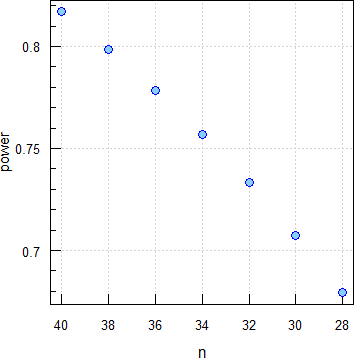

```{r, include = FALSE}
knitr::opts_chunk$set(
  collapse = TRUE,
  comment = "#"
)
```
<div class="top"><a class="toplink" href="#nav" title="&uArr; top">&nbsp;</a></div>
<div id="nav">
<ul>
<li>[Main Vignette](vignette.html)</li>
<li><span title="» You are here «">ABE</span></li>
<li>[RSABE](RSABE.html "Reference-scaled Average Bioequivalence")</li>
<li>[Non-Inferiority](NI.html)</li>
<li>[Dose-Proportionality](DP.html)</li>
<li>[Power Analysis](PA.html)</li>
</ul>
</div>
<h3>Details and examples of other methods are accessible via the menu bar on top of the page and in the <a href="https://cran.r-project.org/package=PowerTOST/PowerTOST.pdf" title="PDF">Online manual</a> of all functions.</h3>

```{r setup}
library(PowerTOST) # attach the library
```
# Defaults

| Parameter | Argument | Purpose | Default |
|-|-----|---------------|-------|
| $\small{\alpha}$ | `alpha` | Nominal level of the test | `0.05` |
| $\small{\pi}$ | `targetpower` | <span title="typically 0.80 – 0.90">Minimum desired power</span> | `0.80` |
| logscale | `logscale` | Analysis on log-transformed or original scale? | `TRUE` |
| $\small{\theta_0}$ | `theta0` | ‘True’ or assumed deviation of T from R | see below |
| $\small{\theta_1}$ | `theta1` | Lower BE limit | see below |
| $\small{\theta_2}$ | `theta2` | Upper BE limit | see below |
| *CV* | `CV` | CV | none |
| design | `design` | Planned design | `"2x2"` |
| method | `method` | Algorithm | `"exact"` |
| robust | `robust` | ‘Robust’ evaluation (Senn’s basic estimator) | `FALSE` |
| print | `print` | Show information in the console? | `TRUE` |
| details | `details` | Show details of the sample size search? | `FALSE` |
| imax | `imax` | Maximum number of iterations | `100` |

Defaults depending on the argument `logscale`:

| Parameter | Argument | `logscale = TRUE` | `logscale = FALSE` |
|-|----|:--------:|:--------:|
| $\small{\theta_0}$ | `theta0` | `0.95` | `+0.05` |
| $\small{\theta_1}$ | `theta1` | `0.80` | `−0.20` |
| $\small{\theta_2}$ | `theta2` | `1.25` | `+0.20` |

Arguments `targetpower`, `theta0`, `theta1`, `theta2`, and `CV` have to be given as fractions, not in percent.\
The *CV* is generally the *within*- (intra-) subject coefficient of variation. Only for `design = "parallel"` it is the *total* (<span title="also known as">a.k.a.</span> pooled) *CV*.^[It is common a misconception that in a parallel design one obtains the *between*- (inter-) subject variability. The fact that products are administered only once does not mean that the within-subject variability does not exist (we *observed* only one occasion). Hence, the variability consists of both *between*- and *within*-components. We can estimate the between-subject variability *only* in a crossover design. Referring to between-subject variability in a parallel design is sloppy terminology at least.]

The terminology of the argument `design` follows this pattern: `treatments x sequences x periods`. The conventional TR|RT (<span title="also known as">a.k.a.</span> AB|BA) design can be abbreviated as `"2x2"`. Some call the `"parallel"` design a ‘one-sequence’ design. The design `"paired"` has two periods but no sequences and is the standard design for studying linear pharmacokinetics (where a single dose is followed by multiple doses). A profile in steady state (T) is compared to the one after the single dose (R). Note that the underlying model assumes no period effects.

Implemented exact algorithms are `"exact"` / `"owenq"` (Owen’s Q function, default)^[Owen DB. *A special case of a bivariate non-central t-distribution.* Biometrika. 1965: 52(3/4); 437--46. [doi:10.2307/2333696](https://doi.org/10.2307/2333696).] and `"mvt"` (direct integration of the bivariate non-central *t*-distribution). Approximations are `"noncentral"` / `"nct"` (non-central *t*-distribution) and `"shifted"` / `"central"` (‘shifted’ central *t*-distribution).

`"robust = TRUE"` forces the degrees of freedom to `n-seq` and is used only in higher-order crossover designs. It could be used if the evaluation was done with a mixed-effects model.

With `sampleN.TOST(..., print = FALSE)` results are provided as a data frame^[R Documentation. *R-manual. Data Frames.* 2022-02-08. [Online](https://stat.ethz.ch/R-manual/R-devel/library/base/html/data.frame.html).] with nine columns `Design`, `alpha`, `CV`, `theta0`, `theta1`, `theta2`, `Sample size`, `Achieved power`, and `Target power`.\
To access *e.g.*, the sample size use either `sampleN.TOST(...)[7]` or `sampleN.TOST(...)[["Sample size"]]`. We suggest to use the latter in scripts for clarity.^[In other functions of `PowerTOST` the sample size is not given in the seventh column but always named `"Sample size"`.]

<span class="hl">The estimated sample size gives always the *total* number of subjects (not subject/sequence in crossovers or subjects/group in a parallel design -- like in some other software packages).</span>

# Sample size
Designs with one (parallel) to four periods (replicates) are supported.
```
#     design                        name   df
# "parallel"           2 parallel groups  n-2
#      "2x2"               2x2 crossover  n-2
#    "2x2x2"             2x2x2 crossover  n-2
#    "2x2x3"   2x2x3 replicate crossover 2n-3
#    "2x2x4"   2x2x4 replicate crossover 3n-4
#    "2x4x4"   2x4x4 replicate crossover 3n-4
#    "2x3x3"   partial replicate (2x3x3) 2n-3
#    "2x4x2"            Balaam’s (2x4x2)  n-2
#   "2x2x2r" Liu’s 2x2x2 repeated x-over 3n-2
#   "paired"                paired means  n-1
```
## Example 1
Estimate the sample size for assumed intra-subject *CV* 0.30.
```{r example1a}
sampleN.TOST(CV = 0.30)
```
To get only the sample size:
```{r example1b}
sampleN.TOST(CV = 0.30, details = FALSE, print = FALSE)[["Sample size"]]
```
Note that the sample size is always rounded up to give balanced sequences (here a multiple of two). Since power is higher than our target, likely this was the case here. Let us check that.\
Which power will we get with a sample size of 39?

```{r example1c}
power.TOST(CV = 0.30, n = 39)
```
Confirmed that with 39 subjects we will already reach the target power. That means also that one dropout will not compromise power. We could explore that further in a [Power Analysis](PA.html).

Note that `sampleN.TOST()` is not vectorized. If we are interested in combinations of assumed values:
```{r example1vect}
sampleN.TOST.vectorized <- function(CVs, theta0s, ...) {
  n <- power <- matrix(ncol = length(CVs), nrow = length(theta0s))
  for (i in seq_along(theta0s)) {
    for (j in seq_along(CVs)) {
      tmp         <- sampleN.TOST(CV = CVs[j], theta0 = theta0s[i], ...)
      n[i, j]     <- tmp[["Sample size"]]
      power[i, j] <- tmp[["Achieved power"]]
    }
  }
  DecPlaces <- function(x) match(TRUE, round(x, 1:15) == x)
  fmt.col <- paste0("CV %.",    max(sapply(CVs, FUN = DecPlaces),
                                    na.rm = TRUE), "f")
  fmt.row <- paste0("theta %.", max(sapply(theta0s, FUN = DecPlaces),
                                    na.rm = TRUE), "f")
  colnames(power) <- colnames(n) <- sprintf(fmt.col, CVs)
  rownames(power) <- rownames(n) <- sprintf(fmt.row, theta0s)
  res <- list(n = n, power = power)
  return(res)
}
CVs     <- seq(0.20, 0.40, 0.05)
theta0s <- seq(0.90, 0.95, 0.01)
x       <- sampleN.TOST.vectorized(CV = CVs, theta0 = theta0s,
                                   details = FALSE, print = FALSE)
cat("Sample size\n"); print(x$n); cat("Achieved power\n"); print(signif(x$power, digits = 5))
```
Perhaps the capacity of the clinical site is limited. Any study can also be performed in a replicate design and assessed for ABE. As a rule of thumb the total sample in a 3-period replicate is ~¾ of the 2×2×2 crossover and the one of a 2-sequence 4-period replicate ~½ of the 2×2×2. The number of treatments and hence, of biosamples – which mainly drives the study’s cost – will be roughly the same.
```{r example1d}
designs <- c("2x2x2", "2x2x3", "2x3x3", "2x2x4")
# data.frame of results
res <- data.frame(design = designs, n = NA_integer_,
                  power = NA_real_, n.do = NA_integer_,
                  power.do = NA_real_,
                  stringsAsFactors = FALSE) # this line for R <4.0.0
for (i in 1:4) {
  # print = FALSE suppresses output to the console
  # we are only interested in columns 7-8
  # let's also calculate power for one dropout
  res[i, 2:3] <- sampleN.TOST(CV = 0.30, design = res$design[i],
                              print = FALSE)[7:8]
  res[i, 4]   <- res[i, 2] - 1
  res[i, 5]   <- suppressMessages(
                    power.TOST(CV = 0.30, design = res$design[i],
                               n = res[i, 4]))
}
print(res, row.names = FALSE)
```
As expected – and as a bonus – we obtain a small gain in power, though in the 4-period design with one dropout power will be slightly compromised.\
But why is power in the replicate designs higher than in the 2×2×2 crossover? If residual variances are equal, the width of the confidence interval depends only on the *t*-value and in particular on the degrees of freedom – which themselves depend on the design and the sample size.
```{r example1e, echo = FALSE}
designs <- c("2x2x2", "2x2x3", "2x3x3", "2x2x4")
res <- data.frame(design = rep(NA_character_, 4), name = NA_character_,
                  n = NA_integer_, formula = NA_character_,
                  df = NA_real_, t.value = NA_real_,
                  stringsAsFactors = FALSE) # this line for R <4.0.0
res[, c(2:1, 4)] <- known.designs()[which(known.designs()[, 2] %in% designs), c(9, 2:3)]
for (i in 1:4) {
  res$n[i]  <- sampleN.TOST(CV = 0.30, design = res$design[i],
                            print = FALSE)[["Sample size"]]
  e         <- parse(text = res[i, 4], srcfile = NULL)
  n         <- res$n[i]
  res[i, 5] <- eval(e)
  res$t.value[i] <- signif(qt(1 - 0.05, df = res[i, 5]), 4)
}
res <- res[with(res, order(-n, design)), ]
print(res, row.names = FALSE)
```
If the capacity is 24 beds, we would opt for a 4-period full replicate.

As another option (*e.g.*, if the blood volume is limited and/or there are concerns about a higher dropout-rate in a multiple-period study) we could stay with the 2×2×2 crossover but split the sample size into groups. In Europe (and for the FDA if certain conditions^[Schütz H. *Multi-Group Studies in Bioequivalence. To pool or not to pool? Review of Guidelines.* BioBridges. Prague, 26–27 September, 2018. [Online](https://bebac.at/lectures/Prague2018.pdf#page=7).] are fulfilled), there are no problems pooling the data and use the conventional model.

```
sequence + subject(sequence) + period + treatment
```
However, some regulators prefer to incorporate group-terms in the model.

```
group + sequence + subject(group × sequence) + 
period(group) + group × sequence + treatment
```
Since we have more terms in the model, we will loose some degrees of freedom. Let us explore in simulations how that would impact power. By default function `power.TOST.sds()` performs 100,000 simulations.
```{r example1f}
grouping <- function(capacity, n) {
  # split sample size into >=2 groups based on capacity
  if (n <= capacity) { # make equal groups
    ngrp <- rep(ceiling(n / 2), 2)
  } else {             # at least one = capacity
    ngrp    <- rep(0, ceiling(n / capacity))
    grps    <- length(ngrp)
    ngrp[1] <- capacity
    for (j in 2:grps) {
      n.tot <- sum(ngrp) # what we have so far
      if (n.tot + capacity <= n) {
        ngrp[j] <- capacity
      } else {
        ngrp[j] <- n - n.tot
      }
    }
  }
  return(ngrp = list(grps = length(ngrp), ngrp = ngrp))
}
CV        <- 0.30
capacity  <- 24 # clinical capacity
res       <- data.frame(n = NA_integer_, grps = NA_integer_,
                        n.grp = NA_integer_,
                        m.1 = NA_real_, m.2 = NA_real_)
x         <- sampleN.TOST(CV = CV, print = FALSE, details = FALSE)
res$n     <- x[["Sample size"]]
res$m.1   <- x[["Achieved power"]]
x         <- grouping(capacity = capacity, n = res$n)
res$grps  <- x[["grps"]]
ngrp      <- x[["ngrp"]]
res$n.grp <- paste(ngrp, collapse = "|")
res$m.2   <- power.TOST.sds(CV = CV, n = res$n, grps = res$grps,
                            ngrp = ngrp, gmodel = 2, progress = FALSE)
res$loss <- 100*(res$m.2 - res$m.1) / res$m.1
names(res)[2:6] <- c("groups", "n/group", "pooled model",
                     "group model", "loss (%)")
res[1, 4:6] <- sprintf("%6.4f", res[1, 4:6])
cat("Achieved power and relative loss\n"); print(res, row.names = FALSE)
```
With ~0.5\% the relative loss in power is practically negligible.

## Example 2
Estimate the sample size for equivalence of the ratio of two means with normality on original scale based on Fieller’s (‘fiducial’) confidence interval.^[Fieller EC. *Some Problems In Interval Estimation.* J Royal Stat Soc B. 1954; 16(2): 175--85. [JSTOR:2984043](https://www.jstor.org/stable/2984043).] Crossover design, within-subject *CV*~w~ 0.20, between-subject *CV*~b~ 0.40.
```{r example2}
sampleN.RatioF(CV = 0.20, CVb = 0.40)
```
In this function the default $\small{\alpha}$ is 0.025, since it is intended for studies with clinical endpoints, where the 95\% confidence interval is usually used for equivalence testing.^[EMEA, CPMP. *Points to Consider on Switching between Superiority and Non-Inferiority.* London. 27 July 2000. CPMP/EWP/482/99. [Online](https://www.ema.europa.eu/en/documents/scientific-guideline/points-consider-switching-between-superiority-and-non-inferiority_en.pdf).]

## Example 3{#expl3}
Estimate the sample size based on the results of a 2×2×2 pilot study in 16 subjects where we observed an intra-subject *CV* 0.20 and $\small{\theta_0}$ 0.92.

### Basic{#expl3basic}
If we believe [*sic*] that in the pivotal study both the $\small{\theta_0}$ and *CV* will be *exactly* like in the pilot, this is a straightforward exercise. We simply provide the required arguments.

```{r example3a}
sampleN.TOST(CV = 0.20, theta0 = 0.92)
```
This approach is called by some ‘carved in stone’ because it relies on – very strong – assumptions which likely are not justified. Although power curves are relatively flat close to unity (*i.e.*, the impact on power is small when moving from say, $\small{\theta_0}$ 1 to 0.95) but they are getting increasingly steep when moving away more from unity.

{width=355px}

Both $\small{\theta_0}$ and *CV* (as every estimate) are uncertain to some extent, which depends on the degrees of freedom (sample size and design). Hence, it might not be good idea to perform very small pilot studies (*e.g.*, in only six subjects). Although it might be possible that in the pivotal study the *CV* is indeed *lower* than the one we observed in the pilot, it would be even more risky than the ‘carved in stone’ approach to assume a lower one in planning the pivotal study.

With the function `CVCL()` we can calculate confidence limits of the *CV*. It is advisable to use the upper confidence limit as a conservative approach. As a side effect – if the *CV* will be lower than assumed – we get a ‘safety margin’ for the T/R ratio.
```{r example3b}
df <- 16 - 2 # degrees of freedom of the 2x2x2 crossover pilot
CVCL(CV = 0.20, df = df, side = "upper", alpha = 0.20)[["upper CL"]]
```
I prefer $\small{\alpha=0.20}$ in analogy to the producer’s risk $\small{\beta=0.20}$ when planning for power $\small{\pi=1-\beta=0.80}$. Gould proposed the more liberal $\small{\alpha=0.25}$.^[Gould AL. *Group Sequential Extension of a Standard Bioequivalence Testing Procedure.* J Pharmacokin Biopharm. 1995: 23(1); 57--86. [doi:10.1007/BF02353786](https://doi.org/10.1007/BF02353786).] Let us repeat the sample size estimation based on the upper <span title="Confidence Limit">CL</span> of the CV.
```{r example3c}
CL.upper <- CVCL(CV = 0.20, df = 16 - 2, side = "upper",
                 alpha = 0.20)[["upper CL"]]
res <- sampleN.TOST(CV = CL.upper, theta0 = 0.92, print = FALSE)
print(res[7:8], row.names = FALSE)
```
Of course, this has a massive impact on the sample size, which increases from 28 to 40. It might be difficult to convince the management to invest ~40\% more than with the ‘carved in stone’ approach.

However, we can also explore how power would be affected if our assumption is true and the study will nevertheless be performed with only 28 subjects.
```{r example3d}
CL.upper <- CVCL(CV = 0.20, df = 16 - 2, side = "upper",
                 alpha = 0.20)[["upper CL"]]
power.TOST(CV = CL.upper, theta0 = 0.92, n = 28)
```
There will be a drop in power from the ~0.82 the management expects to only ~0.67. That’s just slightly higher than betting for two dozens in Roulette…

{width=354px}

As mentioned above, if the *CV* turns out to be lower than assumed, we gain a ‘safety margin’ for the T/R ratio. Let us explore that. We perform the study with 40 subjects, the *CV* will be 0.22 (*less* than the ~0.24 we assumed), and the T/R with 0.90 will be *worse* than the 0.92 we assumed.

```{r example3e}
power.TOST(CV = 0.22, theta0 = 0.90, n = 40)
```
Below our target but still acceptable.

### Advanced{#expl3adv}
In the [basic approach](#expl3basic) we concentrated mainly on the uncertainty of the *CV*. But this is not the end of the story. Clearly $\small{\theta_0}$ is uncertain as well. With the function `expsampleN.TOST()` we can dive deeper into this matter. Let us start with the *CV* only.
```{r example3f}
expsampleN.TOST(CV = 0.20, theta0 = 0.92, prior.type = "CV",
                prior.parm = list(m = 16, design = "2x2x2"))
```
Not that bad. The sample size increases fairly from the 28 of the ‘carved in stone’ approach to 30 but is substantially lower than the 40 we estimated based on the upper confidence limit of the *CV*.

Let us keep the *CV* ‘fixed’ and take only the uncertainty of $\small{\theta_0}$ into account.
```{r example3g}
expsampleN.TOST(CV = 0.20, theta0 = 0.92, prior.type = "theta0",
                prior.parm = list(m = 16, design = "2x2x2"))
```
It starts to hurt. We saw already that power curves are getting steep if the T/R ratio is not close to unity. Our $\small{\theta_0}$ 0.92 was not very nice but in the pivotal study it might be even lower as well – which has a larger impact on power than the *CV*.

Now for the ‘worst case scenario’, where we take both uncertainties into account.
```{r example3h}
expsampleN.TOST(CV = 0.20, theta0 = 0.92, prior.type = "both",
                prior.parm = list(m = 16, design = "2x2x2"),
                details = FALSE)
```
This sample size is almost twice the 28 your boss got from a popular Excel-Sheet.^[Dubins D. *My Tiny Contribution to Clinical Research: FARTSSIE.* 2021-03-21. [GitHub](https://github.com/dndubins/FARTSSIE).] If you are not fired right away when suggesting such a study, take it as a warning what *might* happen.\
At least, if the pivotal study is performed in a lower sample size and fails, *you* know why.

{width=354px}

If you are adventurous, consider an Adaptive Two-Stage Sequential Design with sample size re-estimation. Various methods are provided in the package `Power2Stage`.^[Labes D, Lang B, Schütz H. *Power2Stage: Power and Sample-Size Distribution of 2-Stage Bioequivalence Studies.* 2021-11-20. [CRAN](https://cran.r-project.org/package=Power2Stage).]

## Example 4{#expl4}
An alternative to an assumed $\small{\theta_0}$ is *‘Statistical Assurance’*.^[Ring A, Lang B, Kazaroho C, Labes D, Schall R, Schütz H. *Sample size determination in bioequivalence studies using statistical assurance.* Br J Clin Pharmacol. 2019; 85(10): 2369--77. [doi:10.1111/bcp.14055](https://doi.org/10.1111/bcp.14055). [Open access](https://bpspubs.onlinelibrary.wiley.com/doi/epdf/10.1111/bcp.14055).] This concept uses the distribution of T/R-ratios and assumes an uncertainty parameter $\small{\sigma_\textrm{u}}$. A natural assumption is $\small{\sigma_\textrm{u}=1-\theta_0}$, *i.e.*, for the commonly applied $\small{\theta_0=0.95}$ one can use the argument `sem = 0.05` of the function `expsampleN.TOST()` where the argument `theta0` **must** be kept at 1. The following example reproduces Table 1 of the paper.
```{r example4}
CV  <- 0.214
res <- data.frame(target = c(rep(0.8, 5), rep(0.9, 5)),
                  theta0 = rep(c(1, seq(0.95, 0.92, -0.01)), 2),
                  n.1 = NA_integer_, power = NA_real_,
                  sigma.u = rep(c(0.0005, seq(0.05, 0.08, 0.01)), 2),
                  n.2 = NA_integer_, assurance = NA_real_)
for (i in 1:nrow(res)) {
  res[i, 3:4] <- sampleN.TOST(CV = CV, targetpower = res$target[i],
                              theta0 = res$theta0[i], print = FALSE)[7:8]
  res[i, 6:7] <- expsampleN.TOST(CV = CV, targetpower = res$target[i],
                                 theta0 = 1, # mandatory!
                                 prior.type = "theta0",
                                 prior.parm = list(sem = res$sigma.u[i]),
                                 print = FALSE)[9:10]
}
res                 <- signif(res, 3)
res[, 5]            <- sprintf("%.2f", res[, 5])
names(res)[c(3, 6)] <- "n"
print(res, row.names = FALSE)
```
One caveat: Assuming *no* uncertainty ($\small{\sigma_\textrm{u}=0}$) would fail because the level of technical success is zero. Here a small value of 0.0005 was used instead.

## Example 5{#expl5}
Estimate the sample size for a study of two blood pressure lowering drugs in a 2×2×2 design assessing the difference in means of untransformed data (raw, linear scale; *i.e.*, specifying `logscale = FALSE`). In this setup everything has to be given with the same units (*i.e.*, here $\small{\theta_0}$ –5 mm Hg, $\small{\theta_1}$ –15 mm Hg, $\small{\theta_2}$ +15 mm Hg systolic <span title="Blood Pressure">BP</span>).

Assuming a residual standard deviation 20 mm Hg.
```{r example4a}
planned  <- "2x2x2"
logscale <- FALSE
theta0   <- -5
theta1   <- -15
theta2   <- +15 # if not given, -theta1 is used
SD.resid <-  20 # residual standard deviation
sampleN.TOST(CV = SD.resid, theta0 = theta0, theta1 = theta1,
             theta2 = theta2, logscale = logscale, design = planned)
```
Assuming a standard deviation of the difference T – R 28 mm Hg.
```{r example4b}
known    <- known.designs()[, c(2, 6)]           # extract relevant information
bk       <- known[known$design == planned, "bk"] # retrieve design constant
txt      <- paste0("The design constant for design \"",
                   planned, "\" is ", bk)
SD.delta <-  28                                  # standard deviation of the difference
SD.resid <-  SD.delta / sqrt(bk)                 # convert to residual SD
cat(txt); sampleN.TOST(CV = SD.resid, theta0 = theta0,
                       theta1 = theta1, theta2 = theta2,
                       logscale = logscale, design = planned)
```
Note that other software packages (*e.g.*, PASS, nQuery, StudySize,…) require the standard deviation of the difference as input.

## Higher-Order Designs
Designs with three and four treatments/periods are supported.
```
#  design            name   df
#   "3x3"   3x3 crossover 2n-4
# "3x6x3" 3x6x3 crossover 2n-4
#   "4x4"   4x4 crossover 3n-6
```
`"3x3"` denotes the Latin Square (`ABC|BCA|CAB`), `"3x6x3"` the 6-sequence Williams’ design (`ABC|ACB|BAC|BCA|CAB|CBA`), `"4x4"` the Latin Square (`ABCD|BCDA|CDAB|DABC`) or *any* of the possible Williams’ designs with four periods (`ADBC|BACD|CBDA|DCAB`, `ADCB|BCDA|CABD|DBAC`, `ACDB|BDCA|CBAD|DABC`, `ACBD|BADC|CDAB|DBCA`, `ABDC|BCAD|CDBA|DACB`, `ABCD|BDAC|CADB|DCBA`).

Which `design` argument in studies with more than two periods you should use depends on the planned evaluation.

> Suppose we have a bioequivalence study with three treatments – A, B, and C – and the objective of the study is to make pairwise comparisons among the treatments. Suppose further that treatment C is different in kind from A and B, so that the assumption of homogeneous variance among the three treatments is questionable. One way to do the analyses, under normality assumptions, is Two at a Time – e.g., to test hypotheses about A and B, use only the data from A and B. Another way is All at Once – include the data from all three treatments in a single analysis, making pairwise comparisons within this analysis. If the assumption of homogeneous variance is correct, the All at Once approach will provide more <span title="degrees of freedom">d.f.</span> for estimating the common variance, resulting in increased power. If the variance of C differs from that of A and B, the All at Once approach may have reduced power or an inflated type I error rate, depending on the direction of the difference in variances.
> `r tufte::quote_footer('--- Donald J. Schuirmann (2004)^[Schuirmann DJ. *Two at a Time? Or All at Once?* International Biometric Society, Eastern North American Region, Spring Meeting. Pittsburgh, PA. March 28 -- 31, 2004. [Online abstract](https://www.enar.org/meetings/meetings2004/enar_final_program_2004.pdf#page=204).]')`

  * **All at Once**

    In this approach you assume homogenicity in the ANOVA of pooled data and get one residual variance.\
    To plan for this approach specify one of the `design` arguments given above.
  
  * **Two at a Time**

    In this approach – which is preferred by some agencies, *e.g.*, the EMA^[EMA, CHMP. *Guideline on the Investigation of Bioequivalence.* London. 20 January 2010. CPMP/EWP/QWP/1401/98 Rev. 1/ Corr **. [Online](https://www.ema.europa.eu/en/documents/scientific-guideline/guideline-investigation-bioequivalence-rev1_en.pdf#page=14).] ^[EGA. *Revised EMA Bioequivalence Guideline. Questions &amp; Answers.* [Online](https://www.medicinesforeurope.com/wp-content/uploads/2016/03/EGA_BEQ_QA_WEB_QA_1_32.pdf#page=20).] – you exclude one treatment and perform the analysis on the remaining two. That means, you obtain two *separate* Incomplete Block Designs (IBD).\
    One example is comparing a test (`T`) and to references from two different regions (`R1`, `R2`). You get not only two point estimates (like in the ANOVA) but also two within-subject variances (in the comparisons `T` *vs* `R1` and `T` *vs* `R2`).\
    Another example is a pilot study with two candidate treatments (`C1`, `C2`) and one reference (`R`). You would select the candidate with $\small{\min \left\{\left| \log_{e}\theta_\textrm{C1}\right |,\left | \log_{e}\theta_\textrm{C2}\right | \right \}}$ for the pivotal study. If $\small{\left | \log_{e}\theta_\textrm{C1}\right |\sim \left |  \log_{e}\theta_\textrm{C2}\right | }$, select the candidate with lower within-subject variance.\
    To plan for this approach specify `design = "2x2x2"`.

Apart from the regulatory recommendation we suggest this approach, since the ‘All at Once’ approach may lead to biased estimates and an inflated type I error.^[D’Angelo P. *Testing for Bioequivalence in Higher‐Order Crossover Designs: Two‐at‐a‐Time Principle Versus Pooled ANOVA.* 2^nd^ Conference of the Global Bioequivalence Harmonisation Initiative. Rockville, MD. 15--16 September, 2016.]

Three treatments intended for evaluation ‘All at Once’ or ‘Two at a Time’.
```{r higher_order1}
CV  <- 0.20
res <- data.frame(design = c("3x6x3", "2x2x2"), n = NA_integer_,
                  power = NA_real_, stringsAsFactors = FALSE)
for (i in 1:2) {
  res[i, 2:3] <- sampleN.TOST(CV = CV, design = res$design[i],
                              print = FALSE)[7:8]
}
print(res, row.names = FALSE)
```
Four treatments (*e.g.*, Test fasting and fed, Reference fasting and fed).
```{r higher_order2}
CV  <- 0.20
res <- data.frame(design = c("4x4", "2x2x2"), n = NA_integer_,
                  power = NA_real_, stringsAsFactors = FALSE)
for (i in 1:2) {
  res[i, 2:3] <- sampleN.TOST(CV = CV, design = res$design[i],
                              print = FALSE)[7:8]
}
print(res, row.names = FALSE)
```

# Power
Let us first recap the hypotheses in bioequivalence.

  1. The ‘Two One-Sided Tests Procedure’ (TOST)^[Schuirmann DJ. *A Comparison of the Two One-Sided Tests Procedure and the Power Approach for Assessing the Equivalence of Average Bioavailability.* J Pharmacokin Biopharm. 1987; 15(6): 657--80. [doi:10.1007/BF01068419](https://doi.org/10.1007/BF01068419).]
  $$\small{H_\textrm{0L}:\frac{\mu_\textrm{T}}{\mu_\textrm{R}} \leq \theta_1\:vs\:H_\textrm{1L}:\frac{\mu_\textrm{T}}{\mu_\textrm{R}}>\theta_1}$$
  $$\small{H_\textrm{0U}:\frac{\mu_\textrm{T}}{\mu_\textrm{R}} \geq \theta_2\:vs\:H_\textrm{1U}:\frac{\mu_\textrm{T}}{\mu_\textrm{R}}<\theta_2}$$

  2. The confidence interval inclusion approach
  $$\small{H_0:\frac{\mu_\textrm{T}}{\mu_\textrm{R}}\ni \left\{ \theta_1, \theta_2 \right\}\:vs\:H_1:\theta_1<\frac{\mu_\textrm{T}}{\mu_\textrm{R}}<\theta_2}$$

Note that the null hypotheses imply bio<u>**in**</u>equivalence where $\small{\left\{\theta_1,\theta_2\right\}}$ are the lower and upper limits of the bioequivalence range.\
TOST provides a pair of $\small{p}$ values (where $\small{H_0}$ is not rejected if $\small{\max}(p_\textrm{L},p_\textrm{U})>\alpha$) and is of historical interest only because the <span title="Confidence Interval">CI</span> inclusion approach is preferred in regulatory guidelines.

From a regulatory perspective the outcome of a comparative <span title="Bioavailability">BA</span> study is dichotomous. <span class="hl"> *Either* </span> the study demonstrated bioequivalence (confidence interval entirely *within* $\small{\left\{\theta_1,\theta_2\right\}}$) <span class="hl"> *or* </span> not.^[If the <span title="Confidence Interval">CI</span> overlaps $\small{\{\theta_1,\theta_2\}}$, the outcome is indecisive (called ‘the gray zone’ by some). As long as $\small{\theta_0}$ lies within $\small{\{\theta_1,\theta_2\}}$ you can hope to show BE in a larger sample size. However, once $\small{\theta_0}$ approaches one of the limits, if might be futile – even with a very small *CV*. Try\
  `sampleN.TOST(CV = 0.075, theta0 = 0.81)` and then\
  `sampleN.TOST(CV = 0.075, theta0 = 0.80)` to get an idea.] Only if the <span title="Confidence Interval">CI</span> lies entirely *outside* $\small{\{\theta_1,\theta_2\}}$, the null hypothesis is not rejected and further studies not warranted.\
In any case, calculation of *post hoc* (<span title="also known as">a.k.a.</span> *a posteriori*, retrospective) power is futile.^[Hoenig JM, Heisey DM. *The Abuse of Power: The Pervasive Fallacy of Power Calculations for Data Analysis.* Am Stat. 2001; 55(1): 19--24. [Open access](https://www.vims.edu/people/hoenig_jm/pubs/hoenig2.pdf).]

> There is simple intuition behind results like these: If my car made it to the top of the hill, then it is powerful enough to climb that hill; if it didn’t, then it obviously isn’t powerful enough. Retrospective power is an obvious answer to a rather uninteresting question. A more meaningful question is to ask whether the car is powerful enough to climb a particular hill never climbed before; or whether a different car can climb that new hill. Such questions are prospective, not retrospective.
> `r tufte::quote_footer('--- Russell V. Lenth (2000)^[Lenth RA. *Two Sample-Size Practices that I Don’t Recommend.* [Online](http://homepage.divms.uiowa.edu/~rlenth/Power/2badHabits.pdf).]')`

If a study passes – despite lower than desired power – there is [no reason to reject the study](https://forum.bebac.at/forum_entry.php?id=13277#top13277 "Being lucky is not a crime. (ElMaestro)"). It only means that assumptions (‼) in sample size estimation were not realized. The *CV* might have been higher, and/or the T/R-ratio worse, and/or the dropout-rate higher than anticipated. On the other hand, if *post hoc* power is higher than desired, it does not further support a study which already demonstrated BE.

Nevertheless, exploring power is useful when trying to understand why a study failed and to plan another study. Let us continue with the [example](#expl3) from above. Ignoring our concerns, the management decided to perform the pivotal study with 28 subjects. The T/R-ratio was slightly worse (0.90), the *CV* higher (0.25), and we had one dropout in the first sequence and two in the second. The function `CI.BE()` comes handy.
```{r power1}
n <- c(14 - 1, 14 - 2) # 14 dosed in each sequence
round(100*CI.BE(pe = 0.90, CV = 0.25, n = n), 2)
```
The study failed although by a small margin. One might be tempted to repeat the study with an – only slightly – higher sample size. But what was the *post hoc* power of the failed study?
```{r power2}
power.TOST(CV = 0.25, theta0 = 0.90, n = c(13, 12)) # observed values
```
Actually the chance of passing was worse than tossing a coin.

<span title="nota bene">NB</span>, in calculating *post hoc* power the *observed* $\small{\theta_0}$ has to be used. In some statistical reports high *‘power’* is given even for a *failed* study, which is [not even wrong](https://en.wikipedia.org/wiki/Not_even_wrong "Wolfgang Pauli"). Alas, $\small{\theta_0=1}$ is still the default in some software packages.
```{r power3}
power.TOST(CV = 0.20, theta0 = 0.92, n = 28)     # assumed in planning
power.TOST(CV = 0.25, theta0 = 1, n = c(13, 12)) # observed CV but wrong T/R-ratio
```
Since all estimates were worse than assumed, how could one get a ‘power’ even higher than desired, despite the fact that the study *failed* to demonstrate bioequivalence? That’s nonsense, of course. $\small{\theta_0=1}$ gives the ‘power to detect a significant difference of 20%’ – a flawed concept which was abandoned after Schuirmann’s paper of 1987.

# Pooling
When planning the next study one can use the entire arsenal from [above](#expl3). Since we have more accurate estimates (from 25 subjects instead of the 16 of the pilot) the situation is more clear now.\
As a further step we can take the information of both studies into account with the function `CVpooled()`.
```{r pooling}
CVs <- ("  CV |  n | design | study
         0.20 | 16 |  2x2x2 | pilot
         0.25 | 25 |  2x2x2 | pivotal")
txtcon <- textConnection(CVs)
data   <- read.table(txtcon, header = TRUE, sep = "|",
                     strip.white = TRUE, as.is = TRUE)
close(txtcon)
print(CVpooled(data, alpha = 0.20), digits = 4, verbose = TRUE)
```
Before pooling, variances are weighted by the degrees of freedom. Hence, the new estimate is with ~0.23 closer to the 0.25 of the larger study. Note also that the upper confidence limit is with ~0.26 higher than the one of the pilot study with ~0.24.

<h2>Caveats</h2>
Don’t pool data blindly. In the ideal situation you know the entire background of all studies (clinical performance, bioanalytics). Even if all studies were performed at the same <span title="Contract Research Organization">CRO</span>, more things are important. One purpose of a pilot study is to find a suitable sampling schedule. If the sampling schedule of the pilot was not ideal (*e.g.*, *C*~max~ was not sufficiently enough described), pooling is not a good idea. It might well be that in the pivotal study – with a ‘better’ sampling schedule – its *CV* is more reliable. On the other hand, *AUC* is less sensitive to different sampling schedules.

Pooling data from the literature should be done with great caution (if at all). Possibly critical information is missing. Consider using a *CV* from the upper end of values instead. Common sense helps.

An example where pooling could be misleading: *C*~max~ data of pilot and pivotal studies in five different designs with 11 to 39 subjects, fasting/fed, three different bioanalytical methods (<span title="Gas Chromatography">GC</span>/<span title="Electron Capture Detection">ECD</span>, <span title="Liquid Chromatography">LC</span>-<span title="Tandem Mass Spectrometry">MS/MS</span>, <span title="Gas Chromatography">GC</span>/<span title="Mass Spectrometry">MS</span>), chiral and achiral (which is not relevant for this drug since the active enantiomer is ~95% of the total drug and there is no *in vivo* interconversion). Note that most pivotal studies were ‘overpowered’.

{width=407px}

This is an apples-and-oranges comparison. Red squares show *CV*s which were above the upper <span title="Confidence Limit">CL</span> of the pooled *CV*. Given, only in two studies (#1, #6) their lower <span title="Confidence Limit">CL</span> did not overlap the upper one of the pooled *CV*.

> Which side of the great divide are you on? Do you believe that meta is better or do you hold instead that pooling is fooling? Well, to nail my colours to the mast, I belong to the former school. It seems to me that there is no other topic in medical statistics, with the possible exceptions of cross-over trials, bioequivalence and n-of-1 studies, which has the same capacity as this one to rot the brains.
> `r tufte::quote_footer('--- Stephen Senn (2020)^[Senn S. *A Dip in the Pool.* 2020-05-03. [Online](http://www.senns.uk/wprose.html#Pool).]')`

# Hints
## Power Analysis
Although we suggest to explore the various options shown in [Example 3](#expl3), it is worthwhile to have a first look with the function `pa.ABE()`.
```{r PA}
pa.ABE(CV = 0.20, theta0 = 0.92)
```
{height=626px}

This exercise confirms what we already know. The most critical parameter is $\small{\theta_0}$, whereas dropouts are the least important.

More details are given in the vignette [Power Analysis](PA.html).

## Dropouts
As we have seen, the impact of dropouts on power is rather limited. Regularly <span title="Contract Research Organizations">CROs</span> suggest additional subjects to ‘compensate for the potential loss in power’. IMHO, milking sponsors to make wealthy <span title="Contract Research Organizations">CROs</span> richer. Note that the dropout-rate is based on *dosed* subjects. Hence, the correct formula for the adjusted sample size $\small{n{}'}$ based on the estimated one $\small{n}$ is $\small{n{}'=n / (1-{dropout\:rate})}$, and <u>not</u> $\small{n{}'=n \times (1+{dropout\:rate})}$. An example for studies with three periods:
```{r DO}
balance <- function(x, y) {
  return(y * (x %/% y + as.logical(x %% y)))
}
do        <- 0.15 # anticipated dropout-rate 15%
seqs      <- 3
n         <- seq(12L, 96L, 12L)
res       <- data.frame(n = n,
                        adj1 = balance(n / (1 - do), seqs), # correct
                        elig1 = NA_integer_, diff1 = NA_integer_,
                        adj2 = balance(n * (1 + do), seqs), # wrong
                        elig2 = NA_integer_, diff2 = NA_integer_)
res$elig1 <- floor(res$adj1 * (1 - do))
res$diff1 <- sprintf("%+i", res$elig1 - n)
res$elig2 <- floor(res$adj2 * (1 - do))
res$diff2 <- sprintf("%+i", res$elig2 - n)
invisible(
  ifelse(res$elig1 - n >=0,
         res$optim <- res$elig1,
         res$optim <- res$elig2))
res$diff  <- sprintf("%+i", res$optim - n)
names(res)[c(2, 5)] <- c("n'1", "n'2")
res$diff1[which(res$diff1 == "+0")] <- "\u00B10"
res$diff2[which(res$diff2 == "+0")] <- "\u00B10"
res$diff[which(res$diff == "+0")]   <- "\u00B10"
print(res, row.names = FALSE)
```
With the wrong formula – especially for high dropout rates – you might end up with less eligible subjects (`elig2`) than planned thus compromising power. On the other hand, with the correct one (due to rounding up to get balanced sequences) you might end up with slightly too many (`elig1`). Of course, if you want to be one the safe side, you can select the ‘best’ (column `optim`).

## Literature Data
Sometimes the *CV* is not given in the literature. By means of the function `CVfromCI()` we can calculate it from the confidence interval, the design, and the sample size.^[Schütz H. *Sample Size Estimation for BE Studies: Algebra…* Bucharest. 19 March 2013. [Online](https://bebac.at/lectures/Bucharest2013WS1.pdf#page=26)]

```{r lit1}
CVfromCI(lower = 0.8323, upper = 1.0392, design = "2x2x4", n = 26)
```
The method is exact if the subjects/sequence are known. In the literature quite often only the total sample size is given and the function tries to keep sequences as balanced as possible. What if the study was imbalanced?\
A total sample size of 26 was reported. The study was either balanced or imbalanced to an unknown degree:
```{r lit2}
n      <- 26
CV.est <- CVfromCI(lower = 0.8323, upper = 1.0392,
                   design = "2x2x4", n = 26)
n.est  <- sampleN.TOST(CV = CV.est, design = "2x2x4",
                       print = FALSE)[["Sample size"]]
n1     <- balance(seq(n, 18, -1), 2) / 2
n2     <- n - n1
nseqs  <- unique(data.frame(n1 = n1, n2 = n2, n = n))
res    <- data.frame(n1 = nseqs$n1, n2 = nseqs$n2,
                     CV.true = NA_real_,
                     CV.est = CV.est, n.true = NA_integer_,
                     n.est = n.est)
for (i in 1:nrow(res)) {
  res$CV.true[i] <- CVfromCI(lower = 0.8323, upper = 1.0392,
                             design = "2x2x4",
                             n = c(res$n1[i], res$n2[i]))
  res$n.true[i]  <- sampleN.TOST(CV = res$CV.true[i], design = "2x2x4",
                                 print = FALSE)[["Sample size"]]
  res$n.est[i]   <- sampleN.TOST(CV = CV.est, design = "2x2x4",
                                 print = FALSE)[["Sample size"]]
}
print(signif(res, 5), row.names = FALSE)
```
The true *CV* of any imbalanced study might have been lower than what we assumed. That means, if we use the estimated *CV* – falsely assuming balanced sequences – our sample size estimation will always be conservative.

## Direction of Deviation
If you are unsure about the direction of the deviation of T from R (lower or higher) always assume $\small{\theta_0<1}$.
```{r dev}
CV   <- 0.21
d    <- 0.05 # delta 5%, direction unknown
n    <- sampleN.TOST(CV = CV, theta0 = 1 - d, print = FALSE,
                     details = FALSE)[["Sample size"]]
res1 <- data.frame(CV = CV, theta0 = c(1 - d, 1 / (1 - d)),
                   n = n, power = NA_real_)
for (i in 1:nrow(res1)) {
  res1$power[i] <- power.TOST(CV = CV, theta0 = res1$theta0[i], n = n)
}
n    <- sampleN.TOST(CV = CV, theta0 = 1 + d,
                     print = FALSE)[["Sample size"]]
res2 <- data.frame(CV = CV, theta0 = c(1 + d, 1 / (1 + d)),
                   n = n, power = NA_real_)
for (i in 1:nrow(res1)) {
  res2$power[i] <- power.TOST(CV = CV, theta0 = res2$theta0[i], n = n)
}
res <- rbind(res1, res2)
print(signif(res[order(res$n, res$theta0), ], 4), row.names = FALSE)
```
If you use 1.05 (sample size 20) power will be maintained all the way down to its reciprocal (0.9524) but *not* to 0.95 (where you would already need a sample size of 22). On the other hand, 0.95 preserves power up to 1.053. The statement ‘sample size based on a deviation of ±5\%’ seen in many protocol does not make sense.

# Authors
|function|author(s)|
|-------|----|
|`sampleN.TOST`, `power.TOST`, `power.TOST.sds`, `sampleN.RatioF`,<br />`CVCL`, `CI.BE`, `CVpooled`|Detlew Labes|
|`expsampleN.TOST`|<span style="white-space:nowrap">Benjamin Lang, Detlew Labes</span>|
|`CVfromCI`|<span style="white-space:nowrap">Detlew Labes, Helmut Schütz, Benjamin Lang</span>|
|`pa.ABE`|<span style="white-space:nowrap">Helmut Schütz, Detlew Labes</span>|

# License
<h4 class="author">[GPL-3](https://cran.r-project.org/web/licenses/GPL-3 "GNU General Public License, Version 3") `r Sys.Date()` Helmut Schütz</h4>
