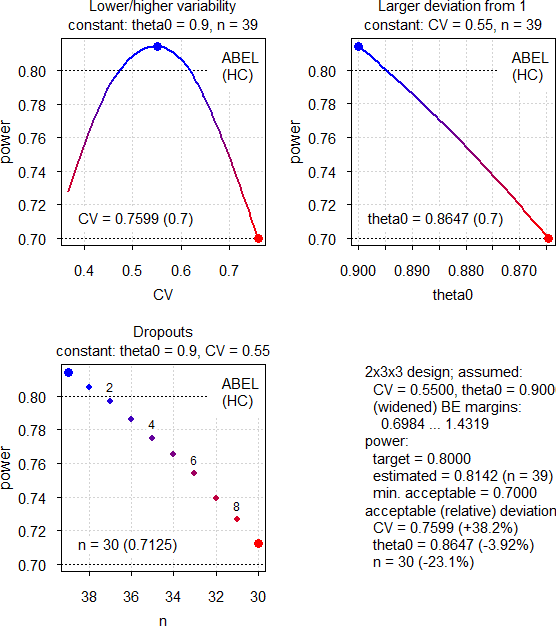

```{r, include = FALSE}
knitr::opts_chunk$set(
  collapse = TRUE,
  comment = "#"
)
```
| [Main Vignette](vignette.html) | [ABE](ABE.html) | [RSABE](RSABE.html) | [Non-Inferiority](NI.html) | [Dose-Proportionality](DP.html) | <span title="You are here">Power Analysis</span> |
|:-:|:-:|:-:|:-:|:-:|:-:|
```{r setup}
library(PowerTOST) # attach the library
```

# Defaults

| Parameter | Argument | Purpose | Default |
|-|----|--------------|-------|
| *CV* | `CV` | CV | none |
| $\theta_{0}$ | `theta0` | ‘True’ or assumed deviation of T from R | 0.95 |
| $\pi$ | `targetpower` | <span title="typically 0.80 – 0.90">Minimum desired power</span> | 0.80 |
| $\pi$ | `minpower` | Minimum acceptable power | 0.70 |
| design | `design` | Planned design | \"2x2\" |
| passed | `...` | Arguments to `power.TOST` | none |

If no addtional arguments are passed, the defaults of `power.TOST` are applied: `alpha=0.05`, `theta1=0.80`, `theta2=1.25`. Note that analysis of untransformed data (`logscale=FALSE`) is not supported.

Arguments have to be given as ratios, not percent.\
The *CV* is generally the *within*-subject coefficient of variation. Only for `design="parallel"` it is the *total* (a.k.a. pooled) *CV*.

The terminology of the `design` argument follows this pattern: `treatments x sequences x periods`. The conventional TR|RT (a.k.a. AB|BA) design can be abbreviated as `2x2`. Some call the `parallel` design a ‘one-sequence’ design. The `paired` design has two periods but no sequences, *e.g.*, in studying linear pharmacokinetics a single dose is followed by multiple doses. A profile in steady state (T) is compared to the one after the single dose (R). Note, that the underlying model assumes no period effects.\
In replicate designs only homoscedasticity (*CV~wT~* = *CV~wR~*) is supported.

With `x <- pa.ABE(...)` results are given as an S3-object which can be printed, plotted, or both.

<small>[TOC ↩](#TOC)</small>

# Examples
## Average Bioequivalence
<h3>[Example 1](#expl1)</h3>
[Example 3 of the vignette ABE](library/doc/ABE.html#expl3). Assumed $\theta_{0}$ 0.92, *CV* 0.20, all defaults employed.
```{r}
pa.ABE(CV = 0.20, theta0 = 0.92)
```
{width=469px}

The most critical parameter is $\theta_{0}$, whereas dropouts are the least important. We will see such a pattern in other approaches as well.

<small>[TOC ↩](#TOC)</small>

## Reference-scaled Average Bioequivalence
### Highly Variable Drugs / Drug Products
#### EMA
<h5>[Example 2]{#expl2}</h5>
Assumed intra-subject *CV* 0.55 (*CV~wT~* = *CV~wR~*). Defaults (`theta0=0.90`, `targetpower=0.80`, `design="2x3x3"`, `nsims=1e5`) employed.
```{r}
pa.scABE(CV = 0.55)
```
{width=469px}

The idea behing reference-scaling is to preserve power even for high variability without requiring extreme sample sizes. However, we make two interesting observations. At *CV~wR~* 0.55 already the upper cap of scaling (50\%) cuts in and the expanded limits are the same as at *CV~wR~* 0.50. Therefore, if the variability increases, power drops. On the other hand, if the CV decreases, power increases first (because being hit by the upper cap is less likely) and then decreases again (because we can expand the limits less).

<small>[TOC ↩](#TOC)</small>

<h5>[Example 3]{#expl3}</h5>
Assumed intra-subject *CV* 0.40 (*CV~wT~* = *CV~wR~*), 4-period full replicate design. Defaults (`theta0=0.90`, `targetpower=0.80`, `nsims=1e5`) employed.
```{r}
pa.scABE(CV = 0.40, design = "2x2x4")
```
{width=469px}

Here we see a different pattern. With increasing variability power increases (due to more expanding) up to the cap of scaling where it starts to decrease like in the previous example. If the variability decreases, power decreases as well (less expanding). However, close the the switching CV (30\%) power increases again. Although we cannot scale anymore, with 30 subjects the study is essentially ‘overpowered’ for ABE.

<small>[TOC ↩](#TOC)</small>

#### Health Canada
<h5>[Example 4]{#expl4}</h5>

Same data like in [Example 2](expl2).
```{r}
pa.scABE(CV = 0.55, regulator = "HC")
```
{width=469px}

Since we are close to Health Canada’s upper cap of 57.4\%, power drops on both sides. Note that we need three subjects less than for the EMA’s method and *CV~wR~* can increase to \~0.76 until we reach the minimum acceptable power&nbsp;-- which is substantially higher than the \~0.67 for the EMA.

<small>[TOC ↩](#TOC)</small>

#### FDA
<h5>[Example 5]{#expl5}</h5>

Same data like in [Example 2](expl2).
```{r}
pa.scABE(CV = 0.55, regulator = "FDA")
```
{width=469px}

Here we see a pattern which is different to the ones of the EMA and Health Canada. Due to the different regulatory constant and no limit of scaling we need only 24 subjects. However, the method is very sensitive to deviations of the point estimate and dropouts.

<small>[TOC ↩](#TOC)</small>

### Narrow Therapeutic Index Drugs (FDA)

<h5>[Example 6]{#expl2}</h5>
Assumed intra-subject *CV* 0.125. Defaults (`theta0=0.975`, `targetpower=0.80`, `design="2x2x4"`, `nsims=1e5`) employed.
```{r}
pa.NTIDFDA(CV = 0.125)
```
{width=469px}

With decreasing variability power decreases because the scaled limits become narrower. With increasing variability we gain power because we have to scale less until at \~21.4\% the addtional criterion ‘must pass conventional BE limits of 80.00--125.00\%’ cuts in.

<small>[TOC ↩](#TOC)</small>

# Authors
|function|author(s)|
|---|-----------|
|`pa.ABE`, `pa.scABE`|Idea and original code by Helmut Schütz with modifications by Detlew Labes|
|`pa.NTIDFDA`|Detlew Labes acc. to code by Helmut Schütz for `pa.ABE` and `pa.scABE`|

# Man-pages
Man-pages of functions used in this vignette:

  * [pa.ABE](library/html/pa.ABE.html)
  * [pa.scABE](library/html/pa.scABE.html)
  * [pa.NTIDFDA](library/html/pa.NTIDFDA.html)

[Online manual](https://cran.r-project.org/package=PowerTOST/PowerTOST.pdf "PDF") of all functions.

# License
[GPL-2](https://cran.r-project.org/web/licenses/GPL-2) | [GPL-3](https://cran.r-project.org/web/licenses/GPL-3)

<small>[TOC ↩](#TOC)</small>