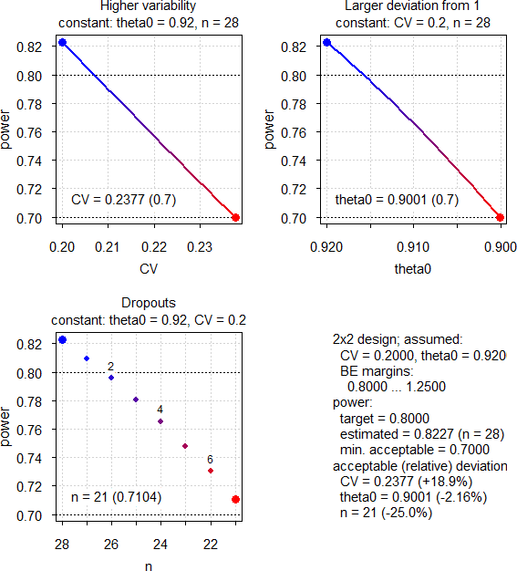
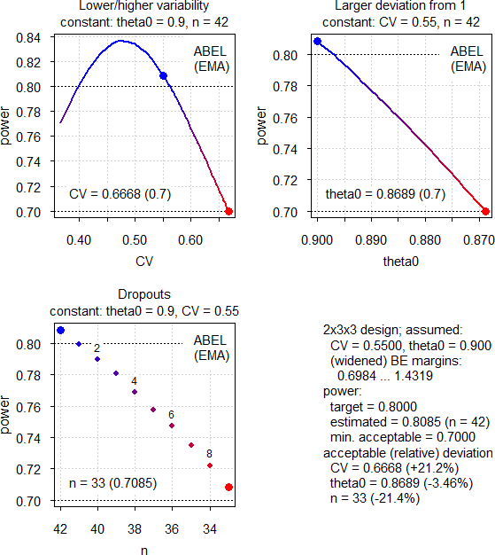
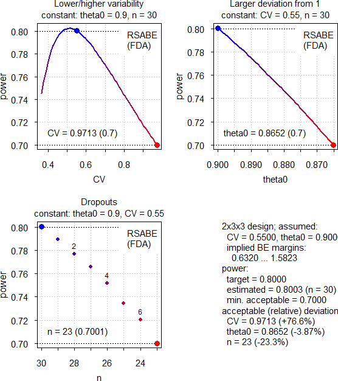
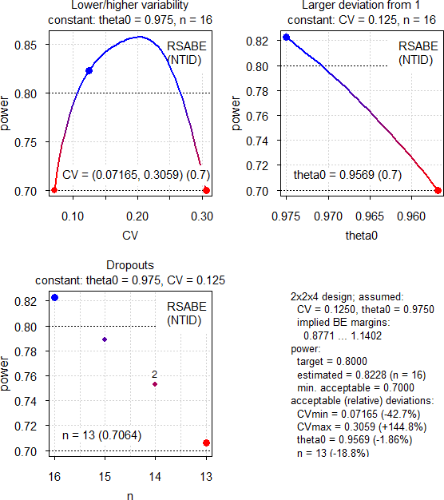

```{r, include = FALSE}
knitr::opts_chunk$set(
  collapse = TRUE,
  comment = "#"
)
```
<div class="top"><a class="toplink" href="#nav" title="&uArr; top">&nbsp;</a></div>
<div id="nav">
<ul>
<li>[Main Vignette](vignette.html)</li>
<li>[ABE](ABE.html "Average Bioequivalence")</li>
<li>[RSABE](RSABE.html "Reference-scaled Average Bioequivalence")</li>
<li>[Non-Inferiority](NI.html)</li>
<li>[Dose-Proportionality](DP.html)</li>
<li><span title="» You are here «">Power Analysis</span></li>
</ul>
</div>
<h3>Details and examples of other methods are accessible via the menu bar on top of the page and in the <a href="https://cran.r-project.org/package=PowerTOST/PowerTOST.pdf" title="PDF">online manual</a> of all functions.</h3>
```{r setup}
library(PowerTOST) # attach the library
```
# Defaults
Note that analysis of untransformed data (`logscale = FALSE`) is not supported. The terminology of the `design` argument follows this pattern: `treatments x sequences x periods`.

With `x <- pa.ABE(...)`, `x <- pa.scABE(...)`, and `x <- pa.NTID(...)` results are given as an S3 object,^[Wickham H. *Advanced R.* 2019-08-08. [The S3 object system](http://adv-r.had.co.nz/S3.html).] which can be printed, plotted, or both.

<span class="hl">The estimated sample sizes give always the *total* number of subjects (not subject/sequence in crossovers or subjects/group in a parallel design – like in some other software packages).</span>

## Function `pa.ABE()`

| Parameter | Argument | Purpose | Default |
|-|----|--------------|-------|
| *CV* | `CV` | CV | none |
| $\small{\theta_0}$ | `theta0` | ‘True’ or assumed deviation of T from R | `0.95` |
| $\small{\pi}$ | `targetpower` | <span title="typically 0.80 – 0.90">Minimum desired power</span> | `0.80` |
| $\small{\pi}$ | `minpower` | Minimum acceptable power | `0.70` |
| design | `design` | Planned design | `"2x2x2"` |
| passed | `...` | Arguments to `power.TOST()` | none |

If no additional arguments are passed, the defaults of `power.TOST()` are applied, namely `alpha = 0.05`, `theta1 = 0.80`, `theta2 = 1.25`.

Arguments `targetpower`, `minpower`, `theta0`, `theta1`, `theta2`, and `CV` have to be given as fractions, not in percent.\
*CV* is generally the *within-* (intra-) subject coefficient of variation. In replicate designs only homoscedasticity (*CV*~wT~ = *CV*~wR~) is supported. For `design = "parallel"` it is the *total* (<span title="also known as">a.k.a.</span> pooled) *CV*.

The conventional TR|RT (<span title="also known as">a.k.a.</span> AB|BA) design can be abbreviated as `"2x2"`. Some call the `"parallel"` design a ‘one-sequence’ design. The `"paired"` design has two periods but no sequences, *e.g.*, in studying linear pharmacokinetics a single dose is followed by multiple doses. A profile in steady state (T) is compared to the one after the single dose (R). Note that the underlying model assumes no period effects.

## Function `pa.scABE()`

| Parameter | Argument | Purpose | Default |
|-|----|--------------|-------|
| *CV* | `CV` | CV | none |
| $\small{\theta_0}$ | `theta0` | ‘True’ or assumed deviation of T from R | `0.90` |
| $\small{\pi}$ | `targetpower` | <span title="typically 0.80 – 0.90">Minimum desired power</span> | `0.80` |
| $\small{\pi}$ | `minpower` | Minimum acceptable power | `0.70` |
| design | `design` | Planned replicate design | `"2x2x3"` |
| regulator | `regulator` | ‘target’ jurisdiction (see below) | `"EMA"` |
| nsims | `nsims` | Number of simulations | `1e5` |
| passed | `...` | Arguments to `power.scABEL()` or `power.RSABE()` | none |

If no additional arguments are passed, the defaults of `power.scABEL()` and `power.RSABE()` are applied, namely `alpha = 0.05`, `theta1 = 0.80`, `theta2 = 1.25`. Note the recommended<small> </small>^[Tóthfalusi L, Endrényi L. *Sample Sizes for Designing Bioequivalence Studies for Highly Variable Drugs.* J Pharm Pharmaceut Sci. 2011;15(1):73--84. [Open access](http://ejournals.library.ualberta.ca/index.php/JPPS/article/download/11612/9489).] default $\small{\theta_0}$ 0.90 for <span title="Highly Variable Drug Products">HVDPs</span>.\
`regulator` can be `"EMA"`, `"HC"`, `"GCC"`, or `"FDA"`.

Arguments `targetpower`, `minpower`, `theta0`, `theta1`, `theta2`, and `CV` have to be given as fractions, not in percent. *CV* is the *within-* (intra-) subject coefficient of variation, where only homoscedasticity (*CV*~wT~ = *CV*~wR~) is supported.

## Function `pa.NTIDFDA()`

| Parameter | Argument | Purpose | Default |
|-|----|--------------|-------|
| *CV* | `CV` | CV | none |
| $\small{\theta_0}$ | `theta0` | ‘True’ or assumed deviation of T from R | `0.975` |
| $\small{\pi}$ | `targetpower` | <span title="typically 0.80 – 0.90">Minimum desired power</span> | `0.80` |
| $\small{\pi}$ | `minpower` | Minimum acceptable power | `0.70` |
| design | `design` | Planned replicate design | `"2x2x4"` |
| nsims | `nsims` | Number of simulations | `1e5` |
| passed | `...` | Arguments to `power.NTID()` | none |

If no additional arguments are passed, the defaults of `power.NTID()` are applied, namely `alpha = 0.05`, `theta1 = 0.80`, `theta2 = 1.25`. Note the default $\small{\theta_0}$ 0.975 for <span title="Narrow Therapeutic Index Drugs">NTIDs</span> since the FDA requires tighter batch release limits of ±5\% for them.

Arguments `targetpower`, `minpower`, `theta0`, `theta1`, `theta2`, and `CV` have to be given as fractions, not in percent. *CV* is the *within-* (intra-) subject coefficient of variation, where only homoscedasticity (*CV*~wT~ = *CV*~wR~) is supported.

# Examples
## Average Bioequivalence
<h5>[Example 1]{#expl1}</h5>
[Example 3 of vignette ABE](ABE.html#expl3). Assumed *CV* 0.20, $\small{\theta_0}$ 0.92.
```{r example1}
pa.ABE(CV = 0.20, theta0 = 0.92)
```
{height=626px}

The most critical parameter is $\small{\theta_0}$, whereas dropouts are the least important. We will see a similar pattern in other approaches as well.

## Reference-scaled Average Bioequivalence
### Highly Variable Drugs / Drug Products
#### EMA
<h5>[Example 2]{#expl2}</h5>
Assumed intra-subject *CV* 0.55.
```{r example2}
pa.scABE(CV = 0.55)
```
{heigth=626px}

The idea behind reference-scaling is to preserve power even for high variability without requiring extreme sample sizes. However, we make two interesting observations. At *CV*~wR~ 0.55 already the upper cap of scaling (50\%) cuts in and the expanded limits are the same as at *CV*~wR~ 0.50. Therefore, if the variability increases, power decreases. On the other hand, if the CV decreases, power increases first (because being affected by the upper cap is less likely) and then decreases again (because the limits can be less expanded).

<h5>[Example 3]{#expl3}</h5>
Assumed intra-subject *CV* 0.40, 4-period full replicate design.
```{r example3}
pa.scABE(CV = 0.40, design = "2x2x4")
```
{height=626px}

Here we see a different pattern. With increasing variability power increases (due to more expanding) up to the cap of scaling where it starts to decrease like in the previous example. If the variability decreases, power decreases as well (less expanding). However, close the the switching *CV*~wR~ (30\%) power increases again. Although we cannot scale anymore, with 30 subjects the study is essentially ‘overpowered’ for <span title="Average Bioequivalence">ABE</span>.

#### Health Canada
<h5>[Example 4]{#expl4}</h5>

Same assumptions (*CV*, $\small{\theta_0}$) like in [Example 2](#expl2).
```{r example4}
pa.scABE(CV = 0.55, regulator = "HC")
```
{height=626px}

Since we are close to Health Canada’s upper cap of 57.4\%, power decreases on both sides. Note that three subjects less than for the <span title="European Medicines Agency">EMA</span>’s method are required and *CV*~wR~ can increase to \~0.76 until we reach the minimum acceptable power – which is substantially higher than the \~0.67 for the <span title="European Medicines Agency">EMA</span>.

#### Gulf Cooperation Council
<h5>[Example 5]{#expl5}</h5>

Same assumptions (*CV*, $\small{\theta_0}$) like in [Example 2](#expl2) and [Example 4](#expl4).
```{r example5}
pa.scABE(CV = 0.55, regulator = "GCC")
```
{height=626px}

Since we are far above the switching *CV*~wR~ of 30\%, (fixed) widened BE margins of 75.00--133.33\% are applicable and the pattern is similar to <span title="Average Bioequivalence">ABE</span>.

#### FDA, CDE
<h5>[Example 6]{#expl6}</h5>

Same assumptions (*CV*, $\small{\theta_0}$) like in [Example 2](#expl2), [Example 4](#expl4) and [Example 5](#expl5).
```{r example6}
pa.scABE(CV = 0.55, regulator = "FDA")
```
{height=626px}

A similar pattern like the one of Health Canada, although due to the different regulatory constants ($\small{\theta_s\approx0.8926}$ *vs* $\small{k=0.760}$ for Health Canada and the <span title="European Medicines Agency">EMA</span>) nine subjects less (and twelve less than for the <span title="European Medicines Agency">EMA</span>) are required. Due to unlimited scaling the *CV* can increase more.

### Narrow Therapeutic Index Drugs (FDA, CDE)

<h5>[Example 7]{#expl7}</h5>
Assumed intra-subject *CV* 0.125.
```{r example7}
pa.NTID(CV = 0.125)
```
{height=626px}

With decreasing variability power decreases because the scaled limits become narrower. With increasing variability we gain power because we have to scale less until at \~21.4\% the additional criterion “must pass conventional BE limits of 80.00--125.00\%” cuts in.

# Cave!
The power analysis is <span class="hl"> not </span> a substitute for the ‘Sensitivity Analysis’ recommended by the ICH.^[International Conference on Harmonisation of Technical Requirements for Registration of Pharmaceuticals for Human Use. *ICH Harmonised Tripartite Guideline. Statistical Principles for Clinical Trials.* 5 February 1998. [E9 Step 4](https://database.ich.org/sites/default/files/E9_Guideline.pdf).] In a real study a combination of all effects occurs simultaneously. It is up to *you* to decide on reasonable combinations and analyze their respective power.

# Authors
|function|author(s)|
|-|----|
|`pa.ABE`, `pa.scABE`|Idea and original code by Helmut Schütz with modifications by Detlew Labes|
|`pa.NTID`|Detlew Labes acc. to code by Helmut Schütz for `pa.ABE` and `pa.scABE`|

# License
<h4 class="author">[GPL-3](https://cran.r-project.org/web/licenses/GPL-3 "GNU General Public License, Version 3") `r Sys.Date()` Helmut Schütz</h4>
