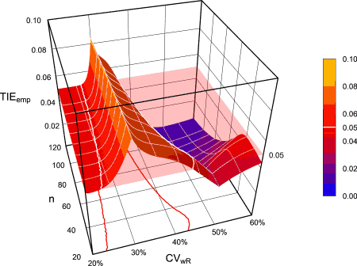

<!-- RSABE.rmd is generated from RSABE.Rmd.orig. Please edit that file -->
<!-- Dont forget to run pre_compute.R if RSABE.Rmd.orig has changed    -->

<div class="top"><a class="toplink" href="#nav" title="&uArr; top">&nbsp;</a></div>
<div id="nav">
<ul>
<li>[Main Vignette](vignette.html)</li>
<li>[ABE](ABE.html "Average Bioequivalence")</li>
<li><span title="» You are here «">RSABE</span></li>
<li>[Non-Inferiority](NI.html)</li>
<li>[Dose-Proportionality](DP.html)</li>
<li>[Power Analysis](PA.html)</li>
</ul>
</div>
<h3>Details and examples of other methods are accessible via the menu bar on top of the page and in the <a href="https://cran.r-project.org/package=PowerTOST/PowerTOST.pdf" title="PDF">online manual</a> of all functions.</h3>

```r
library(PowerTOST) # attach the library
```
# Defaults

| Parameter | Argument | Purpose | Default |
|-|-|-------|-|
| $\small{\alpha}$ | `alpha` | Nominal level of the test | `0.05` |
| $\small{\pi}$ | `targetpower` | <span title="typically 0.80 – 0.90">Minimum desired power</span> | `0.80` |
| $\small{\theta_0}$ | `theta0` | ‘True’ or assumed T/R ratio | `0.90` |
| $\small{\theta_1}$ | `theta1` | Lower BE limit and PE constraint | `0.80` |
| $\small{\theta_2}$ | `theta2` | Upper BE limit and PE constraint | `1.25` |
| *CV* | `CV` | CV | none |
| design | `design` | Planned replicate design | <span title="partial replicate">`"2x3x3"`</span> |
| regulator | `regulator` | ‘target’ jurisdiction | `"EMA"` |
| nsims | `nsims` | Number of simulations | see below |
| nstart | `nstart` | Start if a previous run failed | none |
| imax | `imax` | Maximum number of iterations | `100` |
| print | `print` | Show information in the console? | `TRUE` |
| details | `details` | Show details of the sample size search? | `FALSE` |
| setseed | `setseed` | Issue a fixed seed of the random number generator? | `TRUE` |

Arguments `targetpower`, `theta0`, `theta1`, `theta2`, and `CV` have to be given as fractions, not in percent.\
The *CV* is the *within* (intra-) subject coefficient of variation. If one value is given, homoscedasticity (equal variances) is assumed and therefore, *CV*~wT~ = *CV*~wR~. If two values are given (*i.e.*, `CV = c(x, y)`) heteroscedasticity (unequal variances) is assumed, where `CV[1]` has to be *CV*~wT~ and `CV[2]` *CV*~wR~.

If simulating for power (`theta0` within the BE limits), `nsims` defaults to 100,000. If simulating for the empiric type I error (`theta0` set to one of the BE limits), `nsims` defaults to one million.

<h2>Implemented Designs</h2>
```
#    design                        name   df
#   "2x2x3"   2x2x3 replicate crossover 2n-3
#   "2x2x4"   2x2x4 replicate crossover 3n-4
#   "2x3x3"   partial replicate (2x3x3) 2n-3
```
The terminology of the `design` argument follows this pattern: `treatments x sequences x periods`.

With `foo(..., details = FALSE, print = FALSE)` results are given as a data frame<small> </small>^[R Documentation. *Data Frames.* 2022-02-08. [R-manual](https://stat.ethz.ch/R-manual/R-devel/library/base/html/data.frame.html).] with eleven columns `Design`, `alpha`,  `CVwT`, `CVwR`, `theta0`, `theta1`, `theta2`, `Sample size`, `Achieved power`, `Target power`, and `nlast`. To access *e.g.*, the sample size use either `foo(...)[1, 8]` or `foo(...)[["Sample size"]]`. We suggest to use the latter in your code for clarity.

<span class="hl">The estimated sample size gives always the *total* number of subjects (not subject/sequence – like in some other software packages).</span>

<h2>Conditions and Methods</h2><!-- not in the TOC -->

Regulatory conditions and methods of evaluation are different.

```
#  regulator CVswitch   CVcap r_const      L      U pe_constr method
#        EMA      0.3 0.50000 0.76000 0.6984 1.4319      TRUE  ANOVA
#         HC      0.3 0.57382 0.76000 0.6667 1.5000      TRUE    ISC
#        FDA      0.3    none 0.89257   none   none      TRUE    ISC
```
`CVswitch` is the lower cap of scaling, *i.e.*, if *CV*~wR~ is below this value reference-scaling is not acceptable. The upper cap of scaling `CVcap` differes between the EMA and HC, whereas for the FDA scaling is unlimited. The regulatory constant `r_const` is used for calculating the expanded limits (EMA, HC) and ‘implied limits’ (FDA) based on *s*~wR~: $\small{\left [ L,U \right ]=100\cdot\exp (\mp 0.760\cdot s_{\textrm{wR}})}$\
Here `L` and `U` give the maximum acceptable expansion based on $\small{s_{\textrm{wR}}^{*}=\sqrt{\log_{e}(CV_\textrm{cap}^2)+1}}$. The point estimate constraint `pe_constr` [0.80, 1.25] is applicable in all regulations. Evaluation has to be performed by ANOVA (EMA) or a mixed-effects model (HC, FDA). For the latter intra-subject contrasts are a sufficiently close approximation.
 
# Sample Size
## Highly Variable Drugs / Drug Products
Estimate the sample size for assumed intra-subject *CV* 0.55 (*CV*~wT~ = *CV*~wR~). Employ the defaults (`theta0 = 0.90`, `targetpower = 0.80`, `design = "2x3x3"`, `nsims = 1e5`).

### EMA
Average Bioequivalence with Expanding Limits (ABEL). Default `regulator = "EMA"`.\
Note that this approach is recommended in other jurisdictions as well (*e.g.*, the <span title="World Health Organisation">WHO</span>; <span title="Association of Southeast Asian Nations">ASEAN</span> States, Australia, Brazil, Chile, the East African Community, Egypt, the Eurasian Economic Union, New Zealand, the Russian Federation).

```r
sampleN.scABEL(CV = 0.55)
# 
# +++++++++++ scaled (widened) ABEL +++++++++++
#             Sample size estimation
#    (simulation based on ANOVA evaluation)
# ---------------------------------------------
# Study design: 2x3x3 (partial replicate)
# log-transformed data (multiplicative model)
# 1e+05 studies for each step simulated.
# 
# alpha  = 0.05, target power = 0.8
# CVw(T) = 0.55; CVw(R) = 0.55
# True ratio = 0.9
# ABE limits / PE constraint = 0.8 ... 1.25 
# EMA regulatory settings
# - CVswitch            = 0.3 
# - cap on scABEL if CVw(R) > 0.5
# - regulatory constant = 0.76 
# - pe constraint applied
# 
# 
# Sample size search
#  n     power
# 39   0.7807 
# 42   0.8085
```
<h2>Heterogenicity</h2>
Whilst in full replicate designs simulating via the ‘key’ statistics closely matches the ‘gold standard’ of subject simulations, this is less so for unequal variances in the partial replicate design if *CV*~wT~ > *CV*~wR~. Let us keep *CV*~w~ 0.55 and split variances by a ratio of 1.5 (*i.e.*, T has a higher variance than R).

```r
CV <- signif(CVp2CV(CV = 0.55, ratio = 1.5), 4)
sampleN.scABEL(CV = CV, details = FALSE)
# 
# +++++++++++ scaled (widened) ABEL +++++++++++
#             Sample size estimation
#    (simulation based on ANOVA evaluation)
# ---------------------------------------------
# Study design: 2x3x3 (partial replicate)
# log-transformed data (multiplicative model)
# 1e+05 studies for each step simulated.
# 
# alpha  = 0.05, target power = 0.8
# CVw(T) = 0.6109; CVw(R) = 0.4852
# True ratio = 0.9
# ABE limits / PE constraint = 0.8 ... 1.25 
# Regulatory settings: EMA 
# 
# Sample size
#  n     power
# 45   0.8114
```
Although the runtime will be longer, we recommend the function `sampleN.scABEL.sdsims()` instead.

```r
sampleN.scABEL.sdsims(CV = CV, details = FALSE)
# Be patient. Simulating subject data may take a while!
# 
# +++++++++++ scaled (widened) ABEL +++++++++++
#             Sample size estimation
#    (simulation based on ANOVA evaluation)
# ---------------------------------------------
# Study design: 2x3x3 (partial replicate)
# log-transformed data (multiplicative model)
# 1e+05 studies for each step simulated.
# 
# alpha  = 0.05, target power = 0.8
# CVw(T) = 0.6109; CVw(R) = 0.4852
# True ratio = 0.9
# ABE limits / PE constraint = 0.8 ... 1.25 
# Regulatory settings: EMA 
# 
# Sample size
#  n   power
# 48   0.8161
```
The sample size is slightly larger.

Explore sample sizes for extreme heterogenicity (variance ratio 2.5) via the ‘key’ statistics and subject simulations (4- and 3-period full replicate and partial replicate designs).

```r
CVp <- seq(0.40, 0.70, 0.05)
CV  <- signif(CVp2CV(CV = CVp, ratio = 2.5), 4)
res <- data.frame(CVp = CVp, CVwT = CV[, 1], CVwR = CV[, 2],
                  f4.key = NA, f4.ss = NA, # 4-period full replicate
                  f3.key = NA, f3.ss = NA, # 3-period full replicate
                  p3.key = NA, p3.ss = NA) # 3-period partial replicate
for (i in seq_along(CVp)) {
  res$f4.key[i] <- sampleN.scABEL(CV = CV[i, ], design = "2x2x4",
                                  print = FALSE,
                                  details = FALSE)[["Sample size"]]
  res$f4.ss[i]  <- sampleN.scABEL.sdsims(CV = CV[i, ], design = "2x2x4",
                                         print = FALSE,
                                         details = FALSE,
                                         progress = FALSE)[["Sample size"]]
  res$f3.key[i] <- sampleN.scABEL(CV = CV[i, ], design = "2x2x3",
                                  print = FALSE,
                                  details = FALSE)[["Sample size"]]
  res$f3.ss[i]  <- sampleN.scABEL.sdsims(CV = CV[i, ], design = "2x2x3",
                                         print = FALSE,
                                         details = FALSE,
                                         progress = FALSE)[["Sample size"]]
  res$p3.key[i] <- sampleN.scABEL(CV = CV[i, ], design = "2x3x3",
                                  print = FALSE,
                                  details = FALSE)[["Sample size"]]
  res$p3.ss[i]  <- sampleN.scABEL.sdsims(CV = CV[i, ], design = "2x3x3",
                                         print = FALSE,
                                         details = FALSE,
                                         progress = FALSE)[["Sample size"]]
}
print(res, row.names = FALSE)
#   CVp   CVwT   CVwR f4.key f4.ss f3.key f3.ss p3.key p3.ss
#  0.40 0.4860 0.2975     62    62     90    90     81    87
#  0.45 0.5490 0.3334     60    60     90    90     78    84
#  0.50 0.6127 0.3688     54    54     82    82     69    75
#  0.55 0.6773 0.4038     50    50     76    76     63    69
#  0.60 0.7427 0.4383     46    46     72    72     60    66
#  0.65 0.8090 0.4723     46    46     68    68     57    63
#  0.70 0.8762 0.5059     46    46     70    70     57    63
```
As shown in the previous example, subject simulations are recommended for the partial replicate design. For full replicate designs simulations via the ‘key’ statistics give identical results and are recommended for speed reasons. In this example `sampleN.scABEL()` is 60times faster than `sampleN.scABEL.sdsims()`.\
However, if *CV*~wT~ ≤ *CV*~wR~ we get identical results via the ‘key’ statistics.

### Health Canada
Average Bioequivalence with Expanding Limits (ABEL). Defaults as above but `regulator = "HC"`.

```r
sampleN.scABEL(CV = 0.55, regulator = "HC")
# 
# +++++++++++ scaled (widened) ABEL +++++++++++
#             Sample size estimation
# (simulations based on intra-subject contrasts)
# ----------------------------------------------
# Study design:  2x3x3 (partial replicate) 
# log-transformed data (multiplicative model)
# 1e+05 studies for each step simulated.
# 
# alpha  = 0.05, target power = 0.8
# CVw(T) = 0.55; CVw(R) = 0.55
# True ratio = 0.9
# ABE limits / PE constraint = 0.8 ... 1.25 
# HC regulatory settings
# - CVswitch            = 0.3 
# - cap on scABEL if CVw(R) > 0.57382
# - regulatory constant = 0.76 
# - pe constraint applied
# 
# 
# Sample size search
#  n     power
# 33   0.7539 
# 36   0.7864 
# 39   0.8142
```
### Gulf Cooperation Council
Special case of ABEL: Conventional limits if *CV*~wR~ ≤30\% and widened limits of 0.7500--1.3333 otherwise. 
No upper cap of widening. Defaults as above but `regulator = "GCC"`.
Only to compare with previous studies because since in Version 3.1 of 10 August 2022 the GCC implemented the EMA’s method.

```r
sampleN.scABEL(CV = 0.55, regulator = "GCC")
# 
# +++++++++++ scaled (widened) ABEL +++++++++++
#             Sample size estimation
#    (simulation based on ANOVA evaluation)
# ---------------------------------------------
# Study design: 2x3x3 (partial replicate)
# log-transformed data (multiplicative model)
# 1e+05 studies for each step simulated.
# 
# alpha  = 0.05, target power = 0.8
# CVw(T) = 0.55; CVw(R) = 0.55
# True ratio = 0.9
# ABE limits / PE constraint = 0.8 ... 1.25 
# Widened limits = 0.75 ... 1.333333 
# GCC regulatory settings
# - CVswitch            = 0.3 
# - cap on scABEL if CVw(R) > 0.3
# - regulatory constant = 0.9799758 
# - pe constraint applied
# 
# 
# Sample size search
#  n     power
# 72   0.7874 
# 75   0.8021
```
### FDA
Apart from the FDA only required by China’s agency.

```r
sampleN.RSABE(CV = 0.55)
# 
# ++++++++ Reference scaled ABE crit. +++++++++
#            Sample size estimation
# ---------------------------------------------
# Study design: 2x3x3 (partial replicate)
# log-transformed data (multiplicative model)
# 1e+05 studies for each step simulated.
# 
# alpha  = 0.05, target power = 0.8
# CVw(T) = 0.55; CVw(R) = 0.55
# True ratio = 0.9
# ABE limits / PE constraints = 0.8 ... 1.25 
# FDA regulatory settings
# - CVswitch            = 0.3 
# - regulatory constant = 0.8925742 
# - pe constraint applied
# 
# 
# Sample size search
#  n     power
# 24   0.72002 
# 27   0.76591 
# 30   0.80034
```
Note the lower sample size compared to the other approaches (due to the different regulatory constant and unlimited scaling).

## Narrow Therapeutic Index Drugs (FDA, CDE)
Required by the FDA and the Chinese authority.\
Assuming heteroscedasticity (*CV*~w~ 0.125, *σ*^2^ ratio 2.5, *i.e.*, T has a substantially higher variability than R). Details of the sample size search suppressed. Assess additionally which one of the three components (scaled, ABE, *s*~wT~/*s*~wR~ ratio) drives the sample size.

```r
CV <- signif(CVp2CV(CV = 0.125, ratio = 2.5), 4)
n  <- sampleN.NTID(CV = CV, details = FALSE)[["Sample size"]]
# 
# +++++++++++ FDA method for NTIDs ++++++++++++
#            Sample size estimation
# ---------------------------------------------
# Study design:  2x2x4 (TRTR|RTRT) 
# log-transformed data (multiplicative model)
# 1e+05 studies for each step simulated.
# 
# alpha  = 0.05, target power = 0.8
# CVw(T) = 0.1497, CVw(R) = 0.09433
# True ratio     = 0.975 
# ABE limits     = 0.8 ... 1.25 
# Regulatory settings: FDA 
# 
# Sample size
#  n     power
# 38   0.816080
suppressMessages(power.NTID(CV = CV, n = n, details = TRUE))
#        p(BE)  p(BE-sABEc)    p(BE-ABE) p(BE-sratio) 
#      0.81608      0.93848      1.00000      0.85794
```
The *s*~wT~/*s*~wR~ component shows the lowest power and hence, drives the sample size.  
Compare that with homoscedasticity (*CV*~wT~ = *CV*~wR~ = 0.125):

```r
CV <- 0.125
n  <- sampleN.NTID(CV = CV, details = FALSE)[["Sample size"]]
# 
# +++++++++++ FDA method for NTIDs ++++++++++++
#            Sample size estimation
# ---------------------------------------------
# Study design:  2x2x4 (TRTR|RTRT) 
# log-transformed data (multiplicative model)
# 1e+05 studies for each step simulated.
# 
# alpha  = 0.05, target power = 0.8
# CVw(T) = 0.125, CVw(R) = 0.125
# True ratio     = 0.975 
# ABE limits     = 0.8 ... 1.25 
# Regulatory settings: FDA 
# 
# Sample size
#  n     power
# 16   0.822780
suppressMessages(power.NTID(CV = CV, n = n, details = TRUE))
#        p(BE)  p(BE-sABEc)    p(BE-ABE) p(BE-sratio) 
#      0.82278      0.84869      1.00000      0.95128
```
Here the scaled ABE component shows the lowest power and drives the sample size, which is much lower than in the previous example.

## Highly Variable Narrow Therapeutic Index Drugs (FDA, CDE)
Almost a contradiction in itself. Required for [dagibatran](https://www.accessdata.fda.gov/drugsatfda_docs/psg/Dabigatran%20etexilate%20mesylate_oral%20capsule_NDA%20022512_RV05-17.pdf "Recommended Jun 2012; Revised Sep 2015, Jul 2017"), [rivaroxaban](https://www.accessdata.fda.gov/drugsatfda_docs/psg/Rivaroxaban_oral%20tablet_22406_RC09-15.pdf "Recommended Sep 2015"), and [edoxaban](https://www.accessdata.fda.gov/drugsatfda_docs/psg/PSG_206316.pdf "Recommended May 2017; Revised Mar 2020").\
Assuming homoscedasticity (*CV*~wT~ = *CV*~wR~ = 0.30). Employ the defaults (`theta0 = 0.95`, `targetpower = 0.80`, `design = "2x2x4"`, `nsims = 1e5`). Details of the sample size search suppressed.

```r
sampleN.HVNTID(CV = 0.30, details = FALSE)
# 
# +++++++++ FDA method for HV NTIDs ++++++++++++
#            Sample size estimation
# ----------------------------------------------
# Study design: 2x2x4 (TRTR|RTRT) 
# log-transformed data (multiplicative model)
# 1e+05 studies for each step simulated.
# 
# alpha  = 0.05, target power = 0.8
# CVw(T) = 0.3, CVw(R) = 0.3
# True ratio = 0.95 
# ABE limits = 0.8 ... 1.25 
# 
# Sample size
#  n     power
# 22   0.829700
```
Assuming heteroscedasticity (*CV*~w~ 0.30, *σ*^2^ ratio 2.5).

```r
CV <- signif(CVp2CV(CV = 0.125, ratio = 2.5), 4)
sampleN.HVNTID(CV = CV, details = FALSE)
# 
# +++++++++ FDA method for HV NTIDs ++++++++++++
#            Sample size estimation
# ----------------------------------------------
# Study design: 2x2x4 (TRTR|RTRT) 
# log-transformed data (multiplicative model)
# 1e+05 studies for each step simulated.
# 
# alpha  = 0.05, target power = 0.8
# CVw(T) = 0.1497, CVw(R) = 0.09433
# True ratio = 0.95 
# ABE limits = 0.8 ... 1.25 
# 
# Sample size
#  n     power
# 34   0.818800
```
In this case a substantially higher sample size is required since the variability of T is higher than the one of R.

# Power
Power can by calculated by the counterparts of the respective sample size functions (instead the argument `targetpower` use the argument `n` and provide the observed `theta0`), *i.e.*,\
`power.scABEL()`, `power.RSABE()`, `power.NTID()`, and `power.HVNTID()`.  

# Type I Error
Contrary to average bioequivalence, where the Null-hypothesis is based on fixed limits, in reference-scaling the Null is generated in face of the data (*i.e*, the limits are random variables).

Endrényi and Tóthfalusi (2009,^[Endrényi L, Tóthfalusi L. *Regulatory and study conditions for the determination of bioequivalence of highly variable drugs.* J Pharm Sci. 2009: 12(1); 138--49. [Open access](https://journals.library.ualberta.ca/jpps/index.php/JPPS/article/download/771/5275/0).] 2019^[Endrényi L, Tóthfalusi L. *Bioequivalence for highly variable drugs: regulatory agreements, disagreements, and harmonization.* J Pharmacokin Pharmacodyn. 2019: 46(2); 117--26. [doi:10.1007/s10928-019-09623-w](https://doi.org/10.1007/s10928-019-09623-w).]), Labes (2013^[Labes D. *‘alpha’ of scaled ABE?* BEBA Forum. Vienna, 2013. [Open access](https://forum.bebac.at/mix_entry.php?id=10202#top10202).]), Wonnemann *et al.* (2015^[Wonnemann M, Frömke C, Koch A. *Inflation of the Type I Error: Investigations on Regulatory Recommendations for Bioequivalence of Highly Variable Drugs.* Pharm Res. 2015: 32(1); 135--43. [doi:10.1007/s11095-014-1450-z](https://doi.org/10.1007/s11095-014-1450-z).]), Muñoz *et al.* (2016^[Muñoz J, Alcaide D, Ocaña J. *Consumer’s risk in the EMA and FDA regulatory approaches for bioequivalence in highly variable drugs.* Stat Med. 2016: 35(12); 1933--43. [doi:10.1002/sim.6834](https://doi.org/10.1002/sim.6834).]),
Labes and Schütz (2016^[Labes D, Schütz H. *Inflation of Type I Error in the Evaluation of Scaled Average Bioequivalence, and a Method for its Control.* Pharm Res. 2016: 33(11); 2805--14. [doi:10.1007/s11095-016-2006-1](https://doi.org/10.1007/s11095-016-2006-1).]), Tóthfalusi and Endrényi (2016,^[Tóthfalusi L, Endrényi L. *An Exact Procedure for the Evaluation of Reference-Scaled Average Bioequivalence.* AAPS J. 2016: 18(2); 476--89. [doi:10.1208/s12248-016-9873-6](https://doi.org/10.1208/s12248-016-9873-6).] 2017^[Tóthfalusi L, Endrényi L. *Algorithms for Evaluating Reference Scaled Average Bioequivalence: Power, Bias, and Consumer Risk.* Stat Med. 2017: 36(27); 4378--90. [doi:10.1002/sim.7440](https://doi.org/10.1002/sim.7440).]), Molins *et al.* (2017^[Molins E, Cobo E, Ocaña J. *Two-Stage Designs Versus European Scaled Average Designs in Bioequivalence Studies for Highly Variable Drugs: Which to Choose?* Stat Med. 2017: 36(30); 4777--88. [doi:10.1002/sim.7452](https://doi.org/10.1002/sim.7452).]), Deng and Zhou (2019^[Deng Y, Zhou X-H. *Methods to control the empirical type I error rate in average bioequivalence tests for highly variable drugs.* Stat Meth Med Res. 2019: 29(6). [doi:10.1177/0962280219871589](https://doi.org/10.1177/0962280219871589).]) showed that under certain conditions (EMA, Health Canada: *CV*~wR~ \~0.22--0.45, FDA: *CV*~wR~ ≤0.30) the type I error will be substantially inflated.\
Below the inflation region the study will be evaluated for ABE and the type I error controlled by the TOST. Above the inflation region the type I error is controlled by the PE restriction and for the EMA and Health Canada additionally by the upper cap of scaling.

```r
CV      <- 0.35
res     <- data.frame(n = NA, CV = CV, TIE = NA)
res$n   <- sampleN.scABEL(CV = CV, design = "2x2x4", print = FALSE,
                          details = FALSE)[["Sample size"]]
U       <- scABEL(CV = CV)[["upper"]]
res$TIE <- power.scABEL(CV = CV, n = res$n, theta0 = U, design = "2x2x4")
print(res, row.names = FALSE)
#   n   CV      TIE
#  34 0.35 0.065566
```
With \~0.0656 the type I error is inflated (significantly larger than the nominal $\small{\alpha}$ 0.05).

{width=450px}

A substantially higher inflation of the type I error was reported for the FDA’s model. However, Davit *et al.* (2012^[Davit BM, Chen ML, Conner DP, Haidar SH, Kim S, Lee CH, Lionberger RA, Makhlouf FT, Nwakama PE, Patel DT, Schuirmann DJ, Yu LX. *Implementation of a Reference-Scaled Average Bioequivalence Approach for Highly Variable Generic Drug Products by the US Food and Drug Administration.* AAPS J. 2012: 14(4); 915--24. [doi:10.1208/s12248-012-9406-x](https://doi.org/10.1208/s12248-012-9406-x).]) assessed the type I error not at the [‘implied limits’](#ImpLim) but with the [‘desired consumer risk model’](#DesCRM) if $\small{s_{\textrm{wR}}\geq s_0}$ (*CV*~wR~ ≥\~25.4\%) at $\small{\exp\left ( \log_{e}(1.25)/s_0 \sqrt{\log_{e}(CV_{\textrm{wR}}^2+1)} \right )}$. Some statisticians call the latter ‘hocus-pocus’. However, even with this approach the type I error is still –although less – inflated.

```r
res <- data.frame(CV = sort(c(seq(0.25, 0.32, 0.01), se2CV(0.25))),
                  impl.L = NA, impl.U = NA, impl.TIE = NA,
                  des.L = NA, des.U = NA, des.TIE = NA)
for (i in 1:nrow(res)) {
  res[i, 2:3] <- scABEL(CV = res$CV[i], regulator = "FDA")
  if (CV2se(res$CV[i]) <= 0.25) {
    res[i, 5:6] <- c(0.80, 1.25)
  } else {
    res[i, 5:6] <- exp(c(-1, +1)*(log(1.25)/0.25)*CV2se(res$CV[i]))
  }
  res[i, 4] <- power.RSABE(CV = res$CV[i], theta0 = res[i, 3],
                           design = "2x2x4", n = 32, nsims = 1e6)
  res[i, 7] <- power.RSABE(CV = res$CV[i], theta0 = res[i, 5],
                           design = "2x2x4", n = 32, nsims = 1e6)
}
print(signif(res, 4), row.names = FALSE)
#     CV impl.L impl.U impl.TIE  des.L des.U des.TIE
#  0.250 0.8000  1.250  0.06068 0.8000 1.250 0.06036
#  0.254 0.8000  1.250  0.06396 0.8000 1.250 0.06357
#  0.260 0.8000  1.250  0.07008 0.7959 1.256 0.05692
#  0.270 0.8000  1.250  0.08352 0.7892 1.267 0.05047
#  0.280 0.8000  1.250  0.10130 0.7825 1.278 0.04770
#  0.290 0.8000  1.250  0.12290 0.7760 1.289 0.04644
#  0.300 0.8000  1.250  0.14710 0.7695 1.300 0.04562
#  0.310 0.7631  1.310  0.04515 0.7631 1.310 0.04466
#  0.320 0.7568  1.321  0.04373 0.7568 1.321 0.04325
```

{width=449px}

Various approaches were suggested to control the patient’s risk. The methods of Labes and Schütz (2016) and Molins *et al.* (2017) are implemented in the function `scABEL.ad()`. The method of Tóthfalusi and Endrényi (2017) is implemented in the function `power.RSABE2L.sds()`. 

## Iteratively adjusted α
If an inflated type I error is expected, $\small{\alpha}$ is adjusted based on the observed *CV*~wR~ and the study should be evaluated with a wider confidence interval (Labes and Schütz 2016). Implemented designs: `"2x3x3"` (default), `"2x2x3"`, `"2x2x4"`.\
No adjustment is suggested if the study’s conditions (*CV*~wR~, sample size, design) will not lead to an inflated type I error.

```r
CV <- 0.45
n  <- sampleN.scABEL(CV = CV, design = "2x2x4", print = FALSE,
                     details = FALSE)[["Sample size"]]
scABEL.ad(CV = CV, design = "2x2x4", n = n)
# +++++++++++ scaled (widened) ABEL ++++++++++++
#          iteratively adjusted alpha
#    (simulations based on ANOVA evaluation)
# ----------------------------------------------
# Study design: 2x2x4 (4 period full replicate)
# log-transformed data (multiplicative model)
# 1,000,000 studies in each iteration simulated.
# 
# CVwR 0.45, CVwT 0.45, n(i) 14|14 (N 28)
# Nominal alpha                 : 0.05 
# True ratio                    : 0.9000 
# Regulatory settings           : EMA (ABEL)
# Switching CVwR                : 0.3 
# Regulatory constant           : 0.76 
# Expanded limits               : 0.7215 ... 1.3859
# Upper scaling cap             : CVwR > 0.5 
# PE constraints                : 0.8000 ... 1.2500
# Empiric TIE for alpha 0.0500  : 0.04889
# Power for theta0 0.9000       : 0.811
# TIE ≤ nominal alpha; no adjustment of alpha is required.
```
Inside the region of inflated type I errors.

```r
CV <- 0.35
n  <- sampleN.scABEL(CV = CV, design = "2x2x4", print = FALSE,
                     details = FALSE)[["Sample size"]]
scABEL.ad(CV = CV, design = "2x2x4", n = n)
# +++++++++++ scaled (widened) ABEL ++++++++++++
#          iteratively adjusted alpha
#    (simulations based on ANOVA evaluation)
# ----------------------------------------------
# Study design: 2x2x4 (4 period full replicate)
# log-transformed data (multiplicative model)
# 1,000,000 studies in each iteration simulated.
# 
# CVwR 0.35, CVwT 0.35, n(i) 17|17 (N 34)
# Nominal alpha                 : 0.05 
# True ratio                    : 0.9000 
# Regulatory settings           : EMA (ABEL)
# Switching CVwR                : 0.3 
# Regulatory constant           : 0.76 
# Expanded limits               : 0.7723 ... 1.2948
# Upper scaling cap             : CVwR > 0.5 
# PE constraints                : 0.8000 ... 1.2500
# Empiric TIE for alpha 0.0500  : 0.06557
# Power for theta0 0.9000       : 0.812
# Iteratively adjusted alpha    : 0.03630
# Empiric TIE for adjusted alpha: 0.05000
# Power for theta0 0.9000       : 0.773
```
An adjusted $\small{\alpha}$ of 0.0363 (*i.e.*, the 92.74\% CI) controls the patient’s risk. However, it leads to a slightly lower power (0.773 instead of 0.812).

In order to counteract this loss in power, we can adjust the sample size with the function `sampleN.scABEL.ad()`.

```r
CV <- 0.35
sampleN.scABEL.ad(CV = CV, design = "2x2x4")
# 
# +++++++++++ scaled (widened) ABEL ++++++++++++
#             Sample size estimation
#         for iteratively adjusted alpha
#    (simulations based on ANOVA evaluation)
# ----------------------------------------------
# Study design: 2x2x4 (4 period full replicate)
# log-transformed data (multiplicative model)
# 1,000,000 studies in each iteration simulated.
# 
# Assumed CVwR 0.35, CVwT 0.35
# Nominal alpha      : 0.05 
# True ratio         : 0.9000 
# Target power       : 0.8 
# Regulatory settings: EMA (ABEL)
# Switching CVwR     : 0.3 
# Regulatory constant: 0.76 
# Expanded limits    : 0.7723 ... 1.2948
# Upper scaling cap  : CVwR > 0.5 
# PE constraints     : 0.8000 ... 1.2500
# n  38,   adj. alpha: 0.03610 (power 0.8100), TIE: 0.05000
```
We have to increase the sample size to 38 in order to maintain power. Since the type I error depends to a minor degree on the sample size as well, we have to adjust slightly more ($\small{\alpha}$ 0.0361 instead of 0.0363 with 34 subjects).

Since the observed *CV*~wR~ is not the true – unknown – one, Molins *et al.* recommended to ‘assume the worst’ and adjust for *CV*~wR~ 0.30 in all cases.

```
# CV = 0.35, n = 34, design = "2x2x4"
#               method adj   alpha    TIE power
#  EMA (nominal alpha)  no 0.05000 0.0656 0.812
#     Labes and Schütz yes 0.03630 0.0500 0.773
#        Molins et al. yes 0.02857 0.0500 0.740
```
Although Molin’s adjusted $\small{\alpha}$ controls the patient’s risk, it leads to a further loss in power.

Example with a *CV*~wR~ above the region of inflated type I errors (*i.e.*, >0.45).

```
# CV = 0.8, n = 50, design = "2x2x4"
#            method adj  alpha    TIE power
#  Labes and Schütz  no 0.0500 0.0496 0.812
#     Molins et al. yes 0.0282 0.0500 0.732
```
For high variability the negative impact on power is substantial.

## ‘Exact’ Procedure
Proposed by Tóthfalusi and Endrényi (2016). Example of the ‘ncTOST’ method by the same authors (2017).  Implemented designs: `"2x3x3"` (default), `"2x2x3"`, `"2x2x4"`.

```r
CV <- 0.35
n  <- sampleN.scABEL(CV = CV, design = "2x2x4", print = FALSE,
                     details = FALSE)[["Sample size"]]
U  <- scABEL(CV = CV)[["upper"]]
# subject simulations and therefore, relatively slow
power.RSABE2L.sds(CV = CV, design = "2x2x4", theta0 = U,
                  n = n, SABE_test = "exact", nsims = 1e6,
                  progress = FALSE)
# [1] 0.048177
```
With \~0.0482 the patient’s risk is controlled. However, the regulatory acceptance is unclear.

# Helpers
## BE limits
### Expanded Limits (EMA, Health Canada), widened limits (GCC){#ExpLim}

```r
CV  <- c(0.30, 0.40898, 0.50, 0.57382)
res <- data.frame(CV = CV, EMA.L = NA, EMA.U = NA, EMA.cap = "",
                  HC.L = NA, HC.U = NA, HC.cap = "",
                  GCC.L = NA, GCC.U = NA, GCC.cap = "",
                  stringsAsFactors = FALSE) # this line for R <4.0.0
for (i in seq_along(CV)) {
  res[i, 2:3] <- sprintf("%.4f", scABEL(CV[i], regulator = "EMA"))
  res[i, 5:6] <- sprintf("%.3f", scABEL(CV[i], regulator = "HC"))
  res[i, 8:9] <- sprintf("%.3f", scABEL(CV[i], regulator = "GCC"))
}
res$EMA.cap[res$CV <= 0.30]   <- res$HC.cap[res$CV <= 0.30] <- "lower"
res$EMA.cap[res$CV >= 0.50]   <- "upper"
res$HC.cap[res$CV >= 0.57382] <- "upper"
res$GCC.cap[res$CV <= 0.30]   <- res$GCC.cap[res$CV <= 0.30] <- "lower"
print(res, row.names = FALSE)
#       CV  EMA.L  EMA.U EMA.cap  HC.L  HC.U HC.cap GCC.L GCC.U GCC.cap
#  0.30000 0.8000 1.2500   lower 0.800 1.250  lower 0.800 1.250   lower
#  0.40898 0.7416 1.3484         0.742 1.348        0.750 1.333        
#  0.50000 0.6984 1.4319   upper 0.698 1.432        0.750 1.333        
#  0.57382 0.6984 1.4319   upper 0.667 1.500  upper 0.750 1.333
```
For all agencies the lower cap for scaling is 30\%. Whereas the upper cap for the EMA is at 50\% (expanded limits 69.84--143.19\%), for Health Canada it is at ~57.4\% (expanded limits 66.7--150.0\%). 
The GCC had no upper cap (fixed widened limits 75.00--133.33\%); since August 2022 
the GCC uses the EMA’s method.
### FDA
For the FDA there is no upper cap (scaling is unlimited).

#### ‘Implied’ Limits{#ImpLim}

```r
res <- data.frame(CV = c(0.25, se2CV(0.25), 0.275, 0.3, 0.5, 1.0),
                  impl.L = NA, impl.U = NA, cap = "",
                  stringsAsFactors = FALSE) # this line for R <4.0.0
for (i in 1:nrow(res)) {
  res[i, 2:3] <- sprintf("%.4f", scABEL(CV = res$CV[i],
                                        regulator = "FDA"))
}
res$cap[res$CV <= 0.30] <- "lower"
res$CV <- sprintf("%.3f", res$CV)
print(res, row.names = FALSE)
#     CV impl.L impl.U   cap
#  0.250 0.8000 1.2500 lower
#  0.254 0.8000 1.2500 lower
#  0.275 0.8000 1.2500 lower
#  0.300 0.8000 1.2500 lower
#  0.500 0.6560 1.5245      
#  1.000 0.4756 2.1025
```
#### Limits of the ‘desired consumer risk model’{#DesCRM}

```r
res <- data.frame(CV = c(0.25, se2CV(0.25), 0.275, 0.3, 0.5, 1.0),
                  des.L = NA, des.U = NA, cap = "",
                  stringsAsFactors = FALSE) # this line for R <4.0.0
for (i in 1:nrow(res)) {
  if (CV2se(res$CV[i]) <= 0.25) {
    res[i, 2:3] <- sprintf("%.4f", c(0.80, 1.25))
  } else {
    res[i, 2:3] <- sprintf("%.4f",
                     exp(c(-1, +1)*(log(1.25)/0.25)*CV2se(res$CV[i])))
  }
}
res$cap[res$CV <= 0.30] <- "lower"
res$CV <- sprintf("%.3f", res$CV)
print(res, row.names = FALSE)
#     CV  des.L  des.U   cap
#  0.250 0.8000 1.2500 lower
#  0.254 0.8000 1.2500 lower
#  0.275 0.7858 1.2725 lower
#  0.300 0.7695 1.2996 lower
#  0.500 0.6560 1.5245      
#  1.000 0.4756 2.1025
```

## Regulatory Settings

```r
reg <- c("EMA", "HC", "GCC", "FDA")
for (i in 1:4) {
  print(reg_const(regulator = reg[i]))
  cat("\n")
}
# EMA regulatory settings
# - CVswitch            = 0.3 
# - cap on scABEL if CVw(R) > 0.5
# - regulatory constant = 0.76 
# - pe constraint applied
# 
# HC regulatory settings
# - CVswitch            = 0.3 
# - cap on scABEL if CVw(R) > 0.57382
# - regulatory constant = 0.76 
# - pe constraint applied
# 
# GCC regulatory settings
# - CVswitch            = 0.3 
# - cap on scABEL if CVw(R) > 0.3
# - regulatory constant = 0.9799758 
# - pe constraint applied
# 
# FDA regulatory settings
# - CVswitch            = 0.3 
# - no cap on scABEL
# - regulatory constant = 0.8925742 
# - pe constraint applied
```

# Authors{#authors}
|function|author(s)|
|---|-|
|`sampleN.scABEL`, `sampleN.RSABE`, `sampleN.NTID`, `sampleN.HVNTID`,<br />`power.scABEL`, `power.RSABE2L.sdsims`, `scABEL`, `reg_const`|Detlew Labes|
|`power.scABEL.sdsims`|<span style="white-space:nowrap">Detlew Labes, Benjamin Lang</span>|
|`sampleN.scABEL.ad`, `sampleN.scABEL.sdsims`, `sampleN.RSABE2L.sdsims`,<br />`scABEL.ad`|Helmut Schütz|

# License{#license}
<h4 class="author">[GPL-3](https://cran.r-project.org/web/licenses/GPL-3 "GNU General Public License, Version 3") 2024-02-29 Helmut Schütz</h4>
